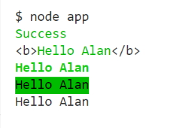

# Node.js Module System

## Importing Node.js Core Modules

Node.js comes with dozens of built-in modules. These built-in modules, sometimes referred to as core modules, give you access to tools for working with the file system, making http requests, creating web servers, and more.

To get started, let's work with some built-in Node.js modules. These are modules that come with Node, so there's no need to install them.

The module system is built around the **require** function. This function is used to load in a
module and get access to its contents. require is a global variable provided to all your
Node.js scripts, so you can use it anywhere you like.

```
    const fs = require('fs');

    fs.writeFileSync('notes.txt', 'I live in Ballarat.');
```

The script above uses require to load in the ``fs`` module. This is a built-in Node.js module that provides functions you can use to manipulate the file system. The script uses ``writeFileSync`` to write a message to *notes.txt*.

You can use another function ``appendFileSync`` to appen more text to the file you have created.

```
    const fs = require('fs');

    fs.writeFileSync('notes.txt', 'I live in Ballarat.');

    fs.appendFileSync('notes.txt', '\nMy name is Alan.');
```

### Importing Your Own Files

Create a new file named *utils.js* with the following console.log() call.

```
    const fs = require('fs');

    fs.writeFileSync('utils.js', 'console.log(\'utils.js\');');
```

Now, in *app.js* add the following line.

```
    require('./utils.js');
```

> utils.js

In this case we require the *utils.js* file and run the contents of that file within our *app.js* file.

You know how to use **require** to load in built-in modules. **require** can also be used to load in JavaScript files  you've created. All you need to do is provide **require** with a relative path to the script you want to load. This path should start with ``./`` and then link to the file that needs to be loaded in.

Now let's create some variables in *utils.js*. Change *app.js* to:

```
    require('./utils.js');

    console.log(name);
```

##### utils.js

```
    console.log('utils.js');

    const name = 'Alan';
```

> ReferenceError: name is not defined

We get an error. This raises an important point.

All external files we create are known as modules and have their own scope with its own variables. *app.js* cannot access the variables in *utils.js* even though it was loaded in with **require**.

We can get around this by exporting the things that *utils.js* should share with *app.js*.

You have to export all of the items that you want to use through another JavaScript file.

##### utils.js

```
    console.log('utils.js');

    const name = 'Alan';

    module.exports = name;
```

##### app.js

```
    const name = require('./utils.js');

    console.log(name);
```

> utils.js
> Alan

We can also export functions.

##### utils.js

```
    console.log('utils.js');

    const name = 'Alan';

    const add = (a, b) => {
        return a + b;
    }

    module.exports = add;
```

##### app.js

```
    const add = require('./utils.js');

    console.log(add(5, 6));
```

> utils.js
> 11

##### Challenge

1. Create a new file named *notes.js*
2. Create getNotes function that returns "your notes...".
3. Export getNotes function.
4. From app.js load in and call the function printing the message to the console.

##### notes.js

```
    const getNotes = function () {
        return 'Your notes...';
    }

    module.exports = getNotes;
```

##### app.js

```
    const getNotes = require('./notes.js');

    const notes = getNotes();

    console.log(notes);
```

> Your notes...

### Importing npm Modules

When you install Node.js, you also get **npm**. **npm** is a package manager that allows you to install and use third-party npm libraries in your code. This opens up a world of possibilities, as there are npm packages for everything from email sending to file uploading. In this lesson, you'll learn how to integrate npm into your Node.js app.

#### Initialising npm

Your Node.js application needs to initialise *npm* before *npm* can be used. You can run ``npm init`` from the root of your project to get that done. That command will ask you a series of questions about the project and it'll use the information to generate a *package.json* file in the root of your project.

```
    npm init
```

This command initialises npm in our project. It creates a configuration file named *project.json*. This package is going to maintain all of the dependencies in our project.

##### package.json

```
    {
      "name": "notes-app",
      "version": "1.0.0",
      "description": "",
      "main": "app.js",
      "scripts": {
        "test": "echo \"Error: no test specified\" && exit 1"
      },
      "author": "",
      "license": "ISC"
    }
```

First we need to find some npm packages to add to our project. Go to:

[npm website](https://npmjs.com/)

We are looking for the *validator* package. When we find it we can go to its npm package page and it will have the command to install it.

```
    npm install validator
```

Look at the package.json file again and you will see that *validator* has been added in as a dependency.

```
    {
      "name": "notes-app",
      "version": "1.0.0",
      "description": "",
      "main": "app.js",
      "scripts": {
        "test": "echo \"Error: no test specified\" && exit 1"
      },
      "author": "",
      "license": "ISC",
      "dependencies": {
        "validator": "^13.0.0"
      }
    }
```

In our project you will see a *node_modules* folder which contains the single validator package. You will also see a *package-lock.json* file. This file has more information on the package we installed. It has a **sha** value in the identity line and if we need to reinstall the package again it will go out and grab the identical package that was initially installed.

You can delete the *node-modules* folder if you want to shift your software. Another user can do a *node install* and it will re-install all of your packages again.

To use the validator package you will have to go to the npm validator package page which lists all of the functions that it contains.

Test the email validation.

##### app.js

```
    const validator = require('validator');
    const getNotes = require('./notes.js');

    const notes = getNotes();

    console.log(notes);

    const email = 'alan@alan.com';

    console.log(validator.isEmail(email));
```

> true

Change email to: 

```
    const email = '@alan.com';

    console.log(validator.isEmail(email));
```

> false

*@alan.com* isn't a valid email address.

Another test.

```
    const url = 'https://www.alan.robson.com.au';

    console.log(validator.isURL(url));
```

> true

It is a valid URL.

There are close to a hundred validators in this package that need to be checked out.

### Printing in Colour

##### Challenge

Use the Chalk library in your project.

1. install v 2.4.1. of chalk.
2. Load chalk into app.js
3. use it to print the string "Success" to the console in green.
4. Test your work.

Bonus: use the docs play around with different options in chalk. Create some bold and inverse text.

```
    const chalk = require('chalk');

    console.log(chalk.green('Success'));
```

##### Output


```
    const chalk = require('chalk');

    console.log(chalk.green('Success'));

    const name = 'Alan';
    console.log(chalk.green('Hello %s').bold(), name);
    console.log(chalk.green.bold('Hello %s'), name);
    console.log(chalk.green.inverse('Hello %s'), name);

    console.log('Hello %s', name);
```



The last line was added because I haven't seen this kind of substitution before. It looks like a C# substitution.

```
    console.log('Hello %s', name);
```

### Global npm Modules and nodemon

You can use npm modules from outside of your scripts by installing them globally. Globally installed modules are designed to be used from the terminal and provide you with new commands you can run. In this lesson, you'll learn how to install and work with global modules.

#### Installing an npm Module Globally

npm modules can be installed globally by adding a ``-g`` flag to the installation command. Not all modules are designed to be installed globally, so be sure to refer to the module documentation to learn how it's supposed to be used.

```
    npm install -g nodemon
```

A globally installed module is not added as a dependency to your project. That means you won't see it listed in package.json or package-lock.json. You also won't find its code in node_modules. Globally installed modules are located in a special directory in your machine which is created and managed by npm.

When you install nodemon globally, you get access to a new nodemon command from the terminal. This can be used to start a Node.js application and then restart the application when any of the app scripts change. This means you won't need to switch between the terminal and text editor to restart your application every time you make a change.

```
    nodemon app.js
```

You can stop nodemon by using ``CTRL+C`` from the terminal.
