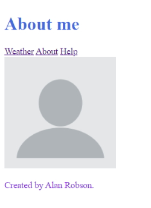

## Web Servers

Node.js is commonly used as a web server to serve up websites, JSON, and more. In this
section, you'll be creating your first Node server with Express. This will allow users to
interact with your application by visiting a URL in the browser.

### Hello Express!

Serving up websites and JSON data is easy with Express. We are going to learn how to
create our first web server with Express. Once the server is up and running, users will be
able to interact with our application via the browser.

First, we are going to create a new folder.

**web-server**

Initialise the project.

```
    npm init -y
```

``-y`` adds defaults to all steps in the process.

Install Express.js

```
    npm install express --save
```

Now, we are going to change our folder structure for Express.js projects.

Create a ``src`` folder and this is where we will place our ``app.js`` files.

#### app.js

```
    const express = require('express');

    const app = express();

    app.get('', (req, res) => {
        res.send('Hello Express World!');
    });

    app.get('/help', (req, res) => {
        res.send('Help page...');
    });

    app.listen(3000, () => {
        console.log('Server is up on port 3000...');
    });
```

This is the code for a bare bones website with two routes, the default page and the help page.

The code above uses **app.get** to set up a handler for an HTTP GET request. The first argument is the path to set up the handler for. The second argument is the function to run when that path is visited. Calling **res.send** in the route handler allows you to send back a message as the response. This will get shown in the browser.

The last thing to do is start the server. This is done by calling **app.listen** with the port you
want to listen on.

We are going to run this with **nodemon**. Go to the **web-server** directory and run,

```
    nodemon src/app.js
```

**Note:** You have to run the application from the root directory.

##### Challenge

Set up two new routes.

1. Set up an about page and set a page title.
2. Set up a weather route and set a page title.
3. Test your work by visiting both pages in the browser.

##### app.js

```
    const express = require('express');

    const app = express();

    app.get('', (req, res) => {
        res.send('Hello Express World!');
    });

    app.get('/help', (req, res) => {
        res.send('Help page...');
    });

    app.get('/about', (req, res) => {
        res.send('About page...');
    });

    app.get('/weather', (req, res) => {
        res.send('Weather page...');
    });

    app.listen(3000, () => {
        console.log('Server is up on port 3000...');
    });
```

### Serving up HTML and JSON

With the basics out of the way, it's time to serve up HTML and JSON with Express. That'll let you serve up a static website or create an HTTP REST API designed to be consumed by a web or mobile application.

#### Serving up HTML and JSON

Using **res.send**, you can send back more than just text. **res.send** can be used to send an HTML or JSON response. The root route below sends back some HTML to be rendered in the browser. The weather route below sends back a JSON response.

```
    app.get('/help', (req, res) => {
        res.send({
            name: 'Alan',
            age: 68
        });
    });

    app.get('/weather', (req, res) => {
        res.send('<h1>Weather page...</h1>');
    });
```

##### Challenge

Update Routes

1. Set up About route to render a HTML title.
2. Set up a weather route to send back some JSON objects with forecast and location strings.
3. Test your code in the browser.

##### Partial app.js

```
    app.get('/about', (req, res) => {
        res.send('<h1>About my website</h1>');
    });

    app.get('/weather', (req, res) => {
        res.send([{
            location: 'Melbourne, Victoria',
            forecast: 12
        },{
            location: 'Dublin, Ireland',
            forecast: 14
        },{
            location: 'Lucerne, Switzerland',
            forecast: 12
        }]);
    });
```

### Serving up Static Assets

Express can serve up all the assets needed for your website. This includes HTML, CSS, JavaScript, images, and more. In this lesson, you'll learn how to serve up an entire directory with Express.

#### Serving up a Static Directory

A modern website is more than just an HTML file. It's styles, scripts, images, and fonts. Everything needs to be exposed via the web server so the browser can load it in. With Express, it's easy to serve up an entire directory without needing to manually serve up each asset. All Express needs is the path to the directory it should serve.

The example below uses Nodes' path module to generate the absolute path. The call to **path.join** allows you to manipulate a path by providing individual path segments. It starts with **__dirname** which is the directory path for the current script. From there, the second segment moves out of the **src** folder and into the **public** directory.

The path is then provided to **express.static** as shown below.

```
    const path = require('path');
    const express = require('express');

    const publicDirectoryPath = path.join(__dirname, '../public');

    const app = express();

    app.use(express.static(publicDirectoryPath));

    app.get('/help', (req, res) => {
        res.send({
            name: 'Alan',
            age: 68
        });
    });

    app.get('/about', (req, res) => {
        res.send('<h1>About my website</h1>');
    });

    app.get('/weather', (req, res) => {
        res.send([{
            location: 'Melbourne, Victoria',
            forecast: 12
        },{
            location: 'Dublin, Ireland',
            forecast: 14
        },{
            location: 'Lucerne, Switzerland',
            forecast: 12
        }]);
    });

    app.listen(3000, () => {
        console.log('Server is up on port 3000...');
    });
```

The ``index.html`` page resides in the public directory. We are running from the **src** directory and we use ``Path`` to find the ``public`` folder so we can serve the ``index.html`` page which is the default. The following lines of code set up the absolute path to the public directory where our static content resides.

```
    const publicDirectoryPath = path.join(__dirname, '../public');

    const app = express();

    app.use(express.static(publicDirectoryPath));
```

This means that the ``app.get()`` call to the default route is redundant so can be removed.

##### Challenge

Create two more HTML pages.

1. Create an About HTML page with an "About" title.
2. Create a Help HTML page with a "Help" title.
3. Remove the old route handlers for both.
4. test your work by visiting both pages.

##### app.js

```
    const path = require('path');
    const express = require('express');

    console.log(__dirname);
    console.log(path.join(__dirname, '../public'));

    const publicDirectoryPath = path.join(__dirname, '../public');

    const app = express();

    app.use(express.static(publicDirectoryPath));

    app.get('/weather', (req, res) => {
        res.send([{
            location: 'Melbourne, Victoria',
            forecast: 12
        },{
            location: 'Dublin, Ireland',
            forecast: 14
        },{
            location: 'Lucerne, Switzerland',
            forecast: 12
        }]);
    });

    app.listen(3000, () => {
        console.log('Server is up on port 3000...');
    });
```

### Serving up CSS, JS, Images, and More

We will use the Express server to serve up a webpage with images, styles, and scripts.

All files in public are exposed via the Express server. This is where your site assets need to live. If they're not in public, then they're not public and the browser won't be able to load them correctly. The HTML file below shows how you can use a CSS file, JavaScript file, and image in your website.

```
    <!DOCTYPE html>
    <html lang="en">
    <head>
        <meta charset="UTF-8">
        <meta name="viewport" content="width=device-width, initial-scale=1.0">
        <title>Weather app</title>
        <link rel="stylesheet" href="/css/styles.css">
    </head>
    <body>
        <h1>About</h1>
        

    </body>
    </html>
```

### Dynamic Pages with Templating

Your web pages don't have to be static. Express supports templating engines that allow you to render dynamic HTML pages. In this lesson, you'll learn how to set up the Handlebars templating engine with Express.

#### Setting up Handlebars

Start by installing Handlebars in your project.

```
    npm i hbs
```

We need to setup handlebars.

```
    const hbs = require('hbs');
```

From there, you'll need to use **app.set** to set a value for the ``'view engine'`` config option. The value is the name of the template engine module you installed. That's ``'hbs'``.

```
    app.set('view engine', 'hbs');
```

You have to set up a view so we have ``app.get()`` set up for the default document.

```
    const app = express();

    app.set('view engine', 'hbs');
    app.use(express.static(publicDirectoryPath));

    app.get('', (req, res) => {
        res.render('index');
    });
```

Create a **views** folder in the root of your application. Add and **index.hbs** file and copy over the contents from **index.html**.

We can now delete **index.html** as we are going to uses the handlebars **index.hbs** file from now on. Change the header to ``Weather``. and run the application.

**Note:** You can continue to serve static page from **public** if you want or dynamic pages from the **views** folder.


#### Rendering Handlebars Templates

By default, Express expects your views to live in a views directory inside of your project root.

Below is an example handlebars view in **views/index.hbs**. This looks like a normal HTML document with a few new features. Notice ``{{title}}`` and ``{{name}}``. This is a Handlebars syntax which allows you to inject variables inside of the template. This is what allows you to generate dynamic pages.

```

    <h1>{{title}}</h1>
    <p>Created by {{name}}.</p>
```

We are now going to build up the other pages as dynamic pages.

##### Challenge

Create a template for the Help page.

1. Set up a help template to render a help message to the screen.
2. Set up the help route and render the template with a help message.
3. Visit the route in the browser and see your help message print.

##### partial help.hbs

```
    <h1>{{title}}</h1>
    <p>{{message}}</p>
```

##### partial app.js

```
    app.get('', (req, res) => {
        res.render('index', {
            title: 'Weather',
            name: 'Alan Robson'
        });
    });

    app.get('/about', (req, res) => {
        res.render('about', {
            title: 'About me',
            name: 'Alan Robson'
        });
    });

    app.get('/help', (req, res) => {
        res.render('help', {
            title: 'Help page',
            message: 'Lorem ipsum dolor sit amet, consectetur adipisicing elit. Cumque reprehenderit fugit soluta veritatis obcaecati corrupti nobis commodi libero laborum consequatur, assumenda, eligendi, tempore sint iusto quo minus doloribus inventore molestiae blanditiis id impedit dolorem neque dolorum fugiat. Similique, eum alias.'
        });
    });
```

### Customizing the Views Directory

We are going to customize the name and location of the views directory.

You can customize the location of the views directory by providing Express with the new path. Call **app.set** to set a new value for the ``'views'`` option. The example below configures Express to look for views in ``templates``.

#### Setting up the templates folder

```
    // Define paths for Express config.
    const publicDirectoryPath = path.join(__dirname, '../public');
    const viewsPath = path.join(__dirname, '../templates');

    const app = express();

    // Setup handlebars engine and views location.
    app.set('view engine', 'hbs');
    app.set('views', viewsPath);

    // Setup static directory to serve.
    app.use(express.static(publicDirectoryPath));
```

### Advanced Templating

We will now learn how to work with Handlebars partials. As the name suggests, partials are just part of a web page. Partials are great for things you need to show on multiple pages like headers, footers, and navigation bars.

#### Setting up Partials

You can use partials by telling Handlebars where you'd like to store them. This is done with a call to ``hbs.registerPartials``. It expects to get called with the **absolute** path to the partials directory.

```
    const hbs = require('hbs');

    console.log(__dirname);
    console.log(path.join(__dirname, '../public'));

    // Define paths for Express config.
    const publicDirectoryPath = path.join(__dirname, '../public');
    const viewsPath = path.join(__dirname, '../templates/views');
    const partialsPath = path.join(__dirname, '../templates/partials');

    const app = express();

    // Setup handlebars engine and views location.
    app.set('view engine', 'hbs');
    app.set('views', viewsPath);
    hbs.registerPartials(partialsPath);

    // Setup static directory to serve.
    app.use(express.static(publicDirectoryPath));
```

Now if we try to run this app it will fail. We have to tell **nodemon** to look for particular file types.

```
    nodemon src/app -e js,hbs
```

Now it will be able to find the hbs partials files.

##### header.hbs

```
    <h1>Static Handlebars partial template</h1>
```

Add it to the help file

##### help.hbs

```
    <body>
        {{>header}}
        <h1>{{title}}</h1>
        <p>{{message}}</p>
    </body>
```

To use partials requires the ``>`` symbol to render the partial file.


Now we will change all headers to the ``header.hbs`` partial file.

##### index.hbs

```
    {{>header}}
    <p>Created by {{name}}.</p>
```

Change the ``header.hbs`` file.

```
    <h1>{{title}}</h1>
```

Make sure all pages have a ``title`` and a ``name``. e.g ``index.hbs``.

```
    app.get('', (req, res) => {
        res.render('index', {
            title: 'Weather',
            name: 'Alan Robson'
        });
    });

    app.get('/about', (req, res) => {
        res.render('about', {
            title: 'About me',
            name: 'Alan Robson'
        });
    });

    app.get('/help', (req, res) => {
        res.render('help', {
            title: 'Help',
            name: 'Alan Robson',
            message: 'Lorem ipsum dolor sit amet, consectetur adipisicing elit.'
        });
    });
```

You can add some navigation into ``header.hbs`` and this will be shown on every page.

```
    <div>
        <a href="/">Weather</a>
        <a href="/about">About</a>
        <a href="/help">Help</a>
    </div>
```


.



##### Challenge

Create a partial for the footer.

1. Set up the partial for the footer template.
2. Render the partial at the bottom of all three pages.
3. Test your work.

##### footer.hbs

```
    <div id="footer">
        <div class="copyright">Created by {{name}}. @2020</div>
    </div>
```

##### index.hbs

```
    <body>
        {{>header}}

        {{>footer}}
    </body>
```

### 404 Pages

We will now set up a 404 page. The 404 page will show when a user tries to visit a page that doesn't exist.

#### Setting up a 404 Page

Express has support for ``*`` in route paths. This is a special character which matches anything. This can be used to create a route handler that matches all requests. The 404 page should be set up just before the call to **app.listen**. This ensures that requests for valid pages still get the correct response.

### Accessing API from Browser

#### Section Intro

In this section, you'll learn how to set up communication between the client and the server. This will be done via HTTP requests. By the end of the section, users will be able to type an address in the browser to view their forecast.

#### The Query String

We need to use query strings to pass data from the client to the server. This will be used to send the address from the browser to Node.js. Node.js will then be able to fetch the weather for the address and send the forecast back to the
browser.

#### Working with Query Strings

The query string is a portion of the URL that allows you to provide additional information to the server. For the weather application, the query string will be used to pass the address from the browser to the Node.js Express application.

We are going set up a **products** route to get a query string to search through a list of products.

```
    app.get('/products', (req, res) => {

        if (!req.query.search) {
            return res.send({
                error: 'You must provide a search term!'
            });
        }

        console.log(req.query);

        res.send({
            products: []
        });
    });
```

This allows us to search for products with a query string.

```
    http://localhost:3000/products?search=games
```

We will use a ``console.log()`` to show what is returned. At present there are no products so you will see this in the terminal.

```
    { search: 'games' }
```

If you fail to add a search query string you will receive a json error.

```
    { "error": "You must provide a search term!" }
```

**Note** We have added a **return** in case a query string isn't added to the request. This stops the code from continuing on to option to get the products data.

##### Challenge

Update weather endpoint to accept address

1. No address, send back an error message.
2. Address, send back the JSON - and address property onto JSON which returns the provided address.
3. Test /weather, weather?address=Melbourne

```
    app.get('/weather', (req, res) => {

        if (!req.query.address) {
            return res.send({
                error: 'You must provide an address!'
            });
        }

        console.log(req.query);

        res.send({
            address: req.query.address
        });
    });
```

> { "address": "Melbourne" }

### Building a JSON HTTP Endpoint

The weather application already has the code in place to fetch the weather for a given address. we are going to wire up the route handler to fetch the weather and send it back to the browser.

#### ES6 Aside: Default Function Parameters

ES6 provides a new syntax to set default values for function arguments. We will use the new syntax to improve and clean up the application code.

We need to copy the **utils** folder from ``weather-app`` to ``web-server``. Now we need to install **postman-request** in ``web-server``.

```
    npm install postman-request
```

##### Challenge

Wire up weather

1. Require geocode/forecast into app.js.
2. Use the address to geocode.
3. Pass the coordinates to forecast.
4. Send back the real forecast and location.

##### app.js

```
    app.get('/weather', (req, res) => {

        if (!req.query.address) {
            return res.send({
                error: 'You must provide an address!'
            });
        }

        geocode(req.query.address, (error, { latitude, longitude, location }) => {
            if (error) {
                return req.send({ error });
            }

            forecast(latitude, longitude, (error, forecastData) => {
                if (error) {
                    return req.send( { error });
                }

                res.send({
                    forecast: forecastData,
                    location,
                    address: req.query.address
                });
            });
        });
    });
```

> {
> "forecast": "It is currently 3 degrees out. It is Mist and there is 0% chance of rain.",
> "location": "Ballarat, Victoria, Australia",
> "address": "Ballarat, Vic"
> }

### ES6 Aside: Default Function Parameters

ES6 provides a new syntax to set default values for function arguments. we will use this new syntax to improve and clean up the application code.

#### Default Function Parameters

Function parameters are undefined unless an argument value is provided when the function is called. ES6 now allows function parameters to be configured with a custom default value.

You can see this in action for the greeter function below. name will be 'user' if no value is provided. age will be undefined if no value is provided.

```
    const greeter = (name = 'user', age) => {
    console.log('Hello ' + name);
    }

    greeter('Alan');

    greeter();
```

> Hello Alan
> Hello user

This code will fail with an exception because it doesn't have any defaults.

```
    const transaction = (type, { label, stock }) => {
        console.log(type, label, stock);
    }

    transaction('order');
```

The default syntax can be used to provide default values when using ES6 destructuring. The transaction function below shows this off by providing a default value for stock.

```
    const transaction = (type, { label, stock = 0 } = {}) => {
        console.log(type, label, stock);
    }

    transaction('order');
```

> order undefined 0

The code above doesn't cause an exception error.

We can now use the default syntax in our *web-server* application. If we run the app with the following.


```
    http://localhost:3000/weather?address=!
```

We get an exception and the page fails to load. The web server stops with the error message.

> TypeError: Cannot read property 'center' of undefined

In ``geocode()`` we provide an ``error`` because no address was passed in but we run into a problem because we are trying to destructure and object with values ``latitude``, ``longitude`` and ``location``.

We can fix this by adding an empty default object.

```
    geocode(req.query.address, (error, { latitude, longitude, location } = {}) => {
```

### Browser HTTP Requests with Fetch

In this lesson, you'll learn how to make HTTP AJAX requests from the browser. This will allow the web application to request the forecast from the Node.js server.

#### The Fetch API

Web APIs provide you with a way to make HTTP requests from JavaScript in the browser. This is done using the **fetch** function. **fetch** expects to be called with the URL as the first argument. It sends off the HTTP request and gives you back the response.

We will do a simple ``fetch()`` call to get a puzzle.

```
    fetch('http://puzzle.mead.io/puzzle').then((response) => {
        response.json().then((data) => {
            console.log(data.puzzle);
        });
    });
```

The **fetch** call below is used to **fetch** the weather for Ballarat. An if statement is then used
to either print the forecast or the error message.

```
    fetch('http://localhost:3000/weather?address=Ballarat').then((response) => {
        response.json().then((data) => {
            if (data.error) {
                console.log(data.error);
            } else {
                console.log(data.location);
                console.log(data.forecast);
            }
        });
    });
```

> Ballarat, Victoria, Australia
> It is currently 11 degrees out. It is Partly cloudy and there is 0% chance of rain.

**Note:** The fetch API will not work in Node.js. We need to use it in a page script file.

### Creating a Search Form

We can now set up the weather search form. This will allow a visitor to type in a location, click submit and then see their real time information.

##### index.hbs

```
    <div class="main-content">
        {{>header}}

        <p>Use this site to get your weather!</p>
        <form action="">
            <input type="text" placeholder="Location...">
            <button>Search</button>
        </form>
    </div>

    {{>footer}}

    <script src="/js/app.js"></script>
```

##### public/js/app.js

```
    const getForecast = (location) => {
        const url = 'http://localhost:3000/weather?address=' + location;

        fetch(url).then((response) => {
            response.json().then((data) => {
                if (data.error) {
                    console.log(data.error);
                } else {
                    console.log(data.location);
                    console.log(data.forecast);
                }
            });
        });
    }

    const weatherForm = document.querySelector('form');
    const search = document.querySelector('input');

    weatherForm.addEventListener('submit', (e) => {
        e.preventDefault();

        const location = search.value;
        getForecast(location)
    });
```

### Wiring up the User Interface

Now, we will learn how to manipulate the text content of HTML elements from JavaScript. That will allow the weather application to render the forecast data to the browser instead of the console.

#### Rendering Dynamic textContent

Set up HTML elements for the messages you want to render. Below is an example paragraph which can be used to render some text from JavaScript. It contains no text by default. It will be updated to show some text as the client-side JavaScript runs.

```
    <p id="message-1"></p>
```

The code below can be used to change the text content of the paragraph. First up, **document.querySelector** is used to target the element. It's used with #, which searches for elements by their ID. The text content can be updated by setting a value on the **textContent** property.

##### Challenge

Rendering content to paragraphs.

1. Select the second p from JavaScript.
2. Just before fetch, render loading message and empty p.
3. If error, render error.
4. If no error, render location and forecast.
5. Test your work for valid and invalid input.

##### public/js/app.js

```
    const getForecast = (location) => {
        const url = 'http://localhost:3000/weather?address=' + location;

        fetch(url).then((response) => {
            response.json().then((data) => {
                if (data.error) {
                    messageOne.textContent = data.error;
                    messageTwo.textContent = '';
                } else {
                    messageOne.textContent = data.location;
                    messageTwo.textContent = data.forecast;
                }
            });
        });
    }

    const weatherForm = document.querySelector('form');
    const search = document.querySelector('input');
    const messageOne = document.querySelector('#message-1');
    const messageTwo = document.querySelector('#message-2');

    weatherForm.addEventListener('submit', (e) => {
        e.preventDefault();

        const location = search.value;
        messageOne.textContent = 'Loading...';
        messageTwo.textContent = '';
        getForecast(location)
    });
```

##### index.hbs

```
    <div class="main-content">
        {{>header}}

        <p>Use this site to get your weather!</p>
        <form action="">
            <input type="text" placeholder="Location...">
            <button>Search</button>
        </form>

        <p id="message-1"></p>
        <p id="message-2"></p>
    </div>

    {{>footer}}

    <script src="/js/app.js"></script>
```

##### styles.css (input elements)

```
    input {
        border: 1px solid #cccccc;
        padding: 8px;
    }

    button {
        cursor: pointer;
        border: 1px solid #888888;
        background: #888888;
        color: white;
        padding: 8px;
    }
```

