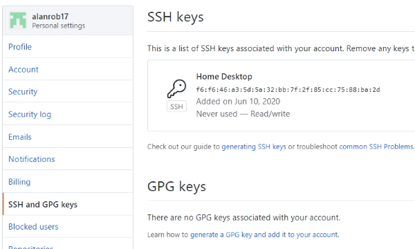

# Application Deployment

## Setting up SSH Keys

We need to set up SSH on our machine. SSH is the protocol used to securely transfer code between your machine and GitHub/Heroku.

## Creating SSH Keys

Windows users won't have access to the necessary SSH commands from the command prompt. Make sure to use Git Bash for the following commands.

SSH uses an SSH key pair to secure the connection between your machine and the machine you're communicating with. You can check if you already have an SSH key pair with the following command. You have a key pair if you see id_rsa and id_rsa.pub in the output.

```
    ls -a -l ~/.ssh
```

You can create a new key pair using the following command. Make sure to swap out the email for your email address.

```
    ssh-keygen -t rsa -b 4096 -C "youremail@domain.com"
```

The SSH key needs to be configured to be used for new SSH connections. First, ensure that the SSH agent is running. You can do that using the command below.

```
    eval "$(ssh-agent -s)"
```

The command below is for Linux users and Windows users.

```
    ssh-add ~/.ssh/id_rsa
```

## Adding the ssh key to GitHub

You need to copy the ssh key to GitHub.

```
    cat ~/.ssh/id_rsa.pub
```

Will print out the key for you. Copy the key from **ssh-rsa** to the end of the email address you created for the key.

Go up to your GitHub site and click on the profile button on the top-right hand corner.

Select the **SSH and GPG Keys** tab. Click on the **ssh keys** section to add a new key.



Add a name for the machine the key was created on (e.g. Home Desktop) and paste the key that you copied from your ~/.ssh key, id_rsa.pub. This should add the ssh key to GitHub.

# Using Heroku

Install command line tools.

```
    heroku --version
```

To get the version number. This tells you that you have successfully installed Heroku.

To login.

```
    heroku login
```

To add your ssh key.

```
    heroku keys:add
```

This will search for your key and pick our only key, id_rsa.pub.

To create a Heroku app.

We need to run this from the **root** of our app. */D/WebDev/Node/node-course/web-server*

```
    heroku create ar-weather
```

If the name is unique it will create the url for you. It will also create the place to push your app.

> https://ar-weather.herokuapp.com/ | https://git.heroku.com/ar-weather.git

In order to run our application we have to tell Heroku which application to run. We can add this to our **package.json** file.

```
    {
      "name": "web-server",
      "version": "1.0.0",
      "description": "",
      "main": "index.js",
      "scripts": {
        "start": "node src/app.js"
      },
      "keywords": [],
      "author": "",
      "license": "ISC",
      "dependencies": {
        "express": "^4.17.1",
        "hbs": "^4.1.1",
        "postman-request": "^2.88.1-postman.23"
      }
    }
```

The following section tells Heroku how to run our application.

```
    "scripts": {
            "start": "node src/app.js"
          },
```

We could also run our application using this command, ``node src/app.js``

In development we hardcoded the ``localhost:3000`` url. We have to remove these from our code.

##### in app.js

```
    const app = express();
    const port = process.env.PORT || 3000;
```

Adds the ``port`` reference.

Change the ``listen`` reference.

```
    app.listen(port, () => {
        console.log('Server is up on port ' + port);
    });
```

You need to change the ``public\src\app.js`` file.

```
    const url = '/weather?address=' + location;
```

Now, we can push our changes to GitHub and then push our changes to Heroku.

```
    git push heroku master
```

## New Feature Deployment Workflow

We'll go through the process of adding a new feature to the application. This includes committing the changes, pushing them to GitHub, and deploying them to Heroku.

##### Challenge

Add new data to forecast

1. Update your forecast data by adding new information.
2. Commit your changes.
3. Push your changes to GitHub and deploy to Heroku.
4. Test your work in the live application.

##### forecast.js

```
    const request = require('postman-request');

    const forecast = (latitude, longitude, callback) =>  {
        const url = 'http://api.weatherstack.com/current?access_key=f41e35407998bf659423ffd2ac284503&query=' + latitude + ','   + longitude + '&units=m';

        request({ url, json: true }, (error, { body }) => {
            if (error) {
                callback('Unable to connect to weather service.');
            } else if (body.error) {
                callback('Unable to find location.');
            } else {
                const tempObject = {
                    temperature: body.current.temperature,
                    precipitation: body.current.precip,
                    description: body.current.weather_descriptions,
                    feelslike: body.current.feelslike
                }

                const { temperature, precipitation, description, feelslike } = tempObject;

                callback(undefined, `It is currently ${temperature} degrees out but feels like ${feelslike} degrees. It is $    {description} and there is ${precipitation}% chance of rain.`);
            }
        });
    }

    module.exports = forecast;
```

To deploy, the workflow is:

```
    git status

    git add .

    git commit -m "Add feels like message to forecast."

    git push

    git status

    git push heroku master
```

## Avoiding Global Modules

Now, we are going to refactor our application to remove the use of global modules. This ensures that your application installs all the dependencies you need to run.

#### Replacing Global Modules with Local Modules

Sick of typing out that long nodemon command? Let's turn it into a script.

You can create a **dev** script with the value **nodemon src/app.js -e js,hbs**. This will start up the dev server anytime you run **npm run dev**.

The dev script needs **nodemon** to be installed. The issue is that **nodemon** isn't listed as a dependency in **package.json**. However, this can be fixed by uninstalling nodemon globally.

```
    npm uninstall -g nodemon
```

Now, install it as a local dependency.

```
    npm install nodemon --save-dev
```

Now, **npm install** will be able to install all your application dependencies, including nodemon!

##### package.json

```
    {
      "name": "web-server",
      "version": "1.0.0",
      "description": "",
      "main": "index.js",
      "scripts": {
        "start": "node src/app.js",
        "dev": "nodemon src/app.js -e js,hbs"
      },
      "keywords": [],
      "author": "",
      "license": "ISC",
      "dependencies": {
        "express": "^4.17.1",
        "hbs": "^4.1.1",
        "postman-request": "^2.88.1-postman.23"
      },
      "devDependencies": {
        "nodemon": "^2.0.4"
      }
    }
```

The script above shows **nodemon** as a dev dependency.

To run the dev script.

```
    npm run dev
```
