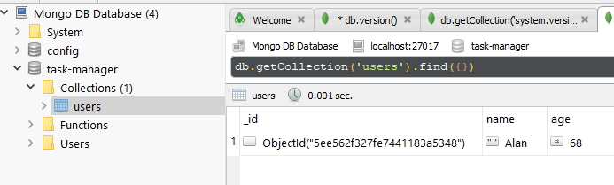

## MongoDB and Promises

### Mongo database terminology


In MongoDB:

A table is called a ``collection``.

A row or record is called a ``document``.

A column is called a ``field``.

### Installing MongoDB on Windows

We will install MongoDB on Windows.

You can download the MongoDB Community Server from the MongoDB download page.

[MongoDB Community Server](https://www.mongodb.com/try/download/community "MongoDB Community Server")

This uses an installer and you can select the folder that you want to store your data in.

My data folder is:

```
    d:\MongoDB\Data
```

This installation automatically starts the server as a service and always runs on your PC.

### Installing Database GUI Viewer

Robo 3T is a MongoDB admin tool that makes it easy to manage and visualize the data in your database.

Robo 3T is a completely free MongoDB admin tool. Grab the installer from here and get it installed on your machine.

[Robo 3T Admin Tool](https://robomongo.org/download "Rbo 3T Admin Tool")


**Note** The default port for MongoDB is **27017**.

To open a shell you can ``right-click`` on the connection you created (MongoDB Database) and select **Open Shell**.


This allows you to enter a query.

```
    db.version()
```

Will show you your database version number.

> 4.2.7

This confirms MongoDB and Robo 3& are working correctly.

When we are working with MongoDB in Robo 3T we are querying in JavaScript.

### Connecting and Inserting Documents

Now we are going to connect to our MongoDB database from our Node.js application. We will learn how to insert documents into the database to save them for later.

### Connecting to MongoDB

MongoDB provides a native driver that allows you to connect to your database from Node. You can grab the driver by installing the mongodb npm module as shown below.

```
    npm i mongodb
```

The document for this are at:

[Node MongoDB documentation](https://mongodb.github.io/node-mongodb-native/3.1/api/ "Node MongoDB documentation")

Create a new folder **task-manager** and navigate to that folder.

Run.

```
    npm i mongodb
```

Now, initialise the project.

```
    npm init -y
```

With the driver installed, you can use the following code to connect to the database. You just need to provide two pieces of information. The first is the connection URL and the second is the name of the database. You can pick any database name that you like.

### Inserting a Document

With the connection open, you're ready to insert documents into the database. Remember that a database is made up of collections, and collections are used to store documents. The code below inserts a new document into the "users" collection. db.collection is used to get a reference to the collection you're trying to manipulate. **insertOne** is used to insert a new document into that collection.

```
    const mongodb = require('mongodb');

    const MongoClient = mongodb.MongoClient;

    const connectionUrl = 'mongodb://127.0.0.1:27017';

    const databaseName = 'task-manager';

    MongoClient.connect(connectionUrl, { useUnifiedTopology : true }, (error, client) => {
        if (error) {
            return console.log('Unable to connect to the database.');
        }

        const db = client.db(databaseName);

        db.collection('users').insertOne({
            name: 'Alan',
            age: 68
        });
    });
```

Run this script and to ensure that our data was inserted correctly we go back to Robo 3T and right click on our connection name and click on the **Refresh** tab. This should now show our database named **task-manager**.



We can query inside the ```task-manager``` database.

```
    db.getCollection('users').find({})
```

In the image above we see a table mode view. We can also select a text view and this will show you the document we inserted.

```
    /* 1 */
    {
        "_id" : ObjectId("5ee562f327fe7441183a5348"),
        "name" : "Alan",
        "age" : 68
    }
```

This has no error checking on the insertion of a user. We can add a callback function to our insertion.

```
    db.collection('users').insertOne({
        name: 'James',
        age: 14
    }, (error, result) => {
        if (error) {
            console.log('Unable to insert user.');
        }

        console.log(result.ops);
    });
```

``result.ops`` returns the following.

> [ { name: 'James', age: 14, _id: 5ee576ec6f8dc60c6850a517 } ]

### Inserting Documents

We are now going to look at another way to insert documents into collections.

You already know that ``insertOne`` can be used to insert a single document. You can also use ``insertMany`` to insert multiple documents at once. The example below inserts three documents into "users" collection. ``insertMany`` expects an array of objects, an array of the documents you want to insert.

```
    db.collection('users').insertMany(
    [{
        name: 'Charley',
        age: 8
    }, {
        name: 'Ethan',
        age: 34
    }, {
        name: 'Justin',
        age: 29
    }], (error, result) => {
        if (error) {
            return console.log('Unable to insert users!');
        }

        console.log(result.ops);
    });
```

Returns:

> [ { name: 'Charley', age: 8, _id: 5ee583506c959709b019fe8a },
>   { name: 'Ethan', age: 34, _id: 5ee583506c959709b019fe8b },
>   { name: 'Justin', age: 29, _id: 5ee583506c959709b019fe8c } ]

##### Challenge

Insert 3 tasks into a tasks collection.

1. Use insertMany to insert 3 documents. description - string, completed - boolean.
2. Setup the callback to print the error or the ops.
3. Run the script.

```
    const mongodb = require('mongodb');

    const MongoClient = mongodb.MongoClient;

    const connectionUrl = 'mongodb://127.0.0.1:27017';

    const databaseName = 'task-manager';

    MongoClient.connect(connectionUrl, { useUnifiedTopology : true }, (error, client) => {
        if (error) {
            return console.log('Unable to connect to the database.');
        }

        const db = client.db(databaseName);

        db.collection('tasks').insertMany(
        [{
            description: 'Take out the rubbish',
            completed: true
        }, {
            description: 'Clean computer room',
            completed: false
        }, {
            description: 'Mow the lawn',
            completed: false
        }], (error, result) => {
            if (error) {
                return console.log('Unable to insert tasks!');
            }

            console.log(result.ops);
        });
    });
```

##### Results

> [ { description: 'Take out the rubbish',
>     completed: true,
>     _id: 5ee5920e559538366c2b774e },
>   { description: 'Clean computer room',
>     completed: false,
>     _id: 5ee5920e559538366c2b774f },
>   { description: 'Mow the lawn',
>     completed: false,
>     _id: 5ee5920e559538366c2b7750 } ]

### The ObjectID

MongoDB uses **ObjectIDs** to create unique identifiers for all the documents in the database. It's different to the traditional auto-incrementing integer ID, but it comes with its own set of advantages.

### Working with ObjectIDs

MongoDB provides ObjectID which can be used to generate new ObjectIDs. The example below generates a new ID and prints it to the console.

```
    const mongodb = require('mongodb');
    const MongoClient = mongodb.MongoClient;
    const ObjectID = mongodb.ObjectId;
```

We can destructure this code to make it simpler.

```
    const { MongoClient, ObjectID } = require('mongodb')
    const id = new ObjectID()
    console.log(id) // Print new id to the console
```

We are going to take this code and add it to our database connection code.

```
    const { MongoClient, ObjectID } = require('mongodb')

    const connectionUrl = 'mongodb://127.0.0.1:27017';

    const databaseName = 'task-manager';

    const id = new ObjectID();

    // show the GUID
    console.log(id);

    // The first 4 characters of a GUID are the timestamp and we can get this by,
    console.log(id.getTimestamp());
```

Creates a GUID and a timestamp.

> 5ee59a61df878024acd06f1e
> 2020-06-14T03:32:49.000Z

An ObjectID is a GUID (Globally Unique Identifier). GUIDs are generated randomly via an algorithm to ensure uniqueness. These ID's can be generated on the server, but as seen in the snippet above, they can be generated on the client as well. That means a client can generate the ID for a document it's about to insert into the database.

We can use this ``id`` as the id when we insert a new document into our database.

```
    const { MongoClient, ObjectID } = require('mongodb')

    const connectionUrl = 'mongodb://127.0.0.1:27017';

    const databaseName = 'task-manager';

    const id = new ObjectID();

    console.log(id);

    MongoClient.connect(connectionUrl, { useUnifiedTopology : true }, (error, client) => {
        if (error) {
            return console.log('Unable to connect to the database.');
        }

        const db = client.db(databaseName);

        db.collection('users').insertOne({
            _id: id,
            name: 'Fred',
            age: 21
        }, (error, result) => {
            if (error) {
                console.log('Unable to insert user.');
            }

            console.log(result.ops);
        });
    });
```

We can see that the id that we created is the one going into the database.

> 5ee59b9775802a3f30f59749
> [ { _id: 5ee59b9775802a3f30f59749, name: 'Fred', age: 21 } ]

The ObjectId is stored in the database as a binary id so it is half the size of a string id.

We can actually see the binary data when we create a new GUID with the following code.

```
    const id = new ObjectID();

    console.log(id);
    console.log(id.id);
    console.log(id.id.length); // the number of bytes to store a GUID.
```

``id.id`` shows the data in binary format.

> 5ee5a2d12290551d1c067de4
> <Buffer 5e e5 a2 d1 22 90 55 1d 1c 06 7d e4>
> 12

We need to know about ObjectID because we are going to use them to search for or delete a document.

### Querying Documents

We are going to learn how to read data from MongoDB. This will allow you to fetch the documents that you had previously inserted.

### Finding Documents

You can search for documents in a given collection using find or findOne. find can be used to fetch multiple documents, while findOne can be used to fetch a single document.
 
The example below uses find to search for documents in the tasks collection. You can provide an object as the first argument to find to filter the documents. The example below sets completed equal to false to fetch only those tasks that haven't been completed.

```
    db.collection('tasks').find({ completed: false }).toArray((error, tasks) => {
        console.log(tasks);
    });
```

> [ { _id: 5ee5920e559538366c2b774f,
>     description: 'Clean computer room',
>     completed: false },
>   { _id: 5ee5920e559538366c2b7750,
>     description: 'Mow the lawn',
>     completed: false } ]

There are a number of other things we can do with ``find``. First thing is to look at the API documentation. ``find`` doesn't use a callback function like ``findOne``, it just returns a cursor. You can use a number of search options on the end of your ``find`` query like only bringing back the first 5 documents. Another option is to get the number of documents that match the search criteria.

```
    db.collection('tasks').find({ completed: false  }).count((error, count) => {
        console.log(count);
    });
```

> 2

``find`` allows us to find multiple documents in a collection. ``findOne`` only brings back one document in a search query.

```
    db.collection('tasks').findOne({ _id: new
        ObjectID("5ee5920e559538366c2b7750") }, (error, task) => {
            console.log(task);
    });
```

> { _id: 5ee5920e559538366c2b7750,
>   description: 'Mow the lawn',
>   completed: false }

Do a search by name.

```
    db.collection('users').findOne({ name: 'Charley' }, (error, user) => {
            console.log(user);
    });
```

> { _id: 5ee583506c959709b019fe8a, name: 'Charley', age: 8 }

I can do a search on two fields.

```
    db.collection('users').findOne({ name: 'Charley', age: 8 }, (error, user) => {
        console.log(user);
    });
```

> { _id: 5ee583506c959709b019fe8a, name: 'Charley', age: 8 }

What happens if I put the wrong age in?

I get a ``null`` back because what I am doing is completely valid but it doesn't return any results.

### Updating Documents

We are now going to update documents stored in MongoDB.

You can update documents in a collection using ``updateOne`` or ``updateMany``. The first argument for both ``updateOne`` and ``updateMany`` is similar to the first argument used with ``find`` or ``findOne``. It's an object that allows you to filter down all the documents to just the ones you want to update.

The update calls require a second argument as well. This is an object where you define the updates you want to make. For this, you need to use one of the supported update operators.

##### Update example

```
    const { MongoClient, ObjectID } = require('mongodb')

    const connectionUrl = 'mongodb://127.0.0.1:27017';

    const databaseName = 'task-manager';

    MongoClient.connect(connectionUrl, { useUnifiedTopology : true }, (error, client) => {
        if (error) {
            return console.log('Unable to connect to the database.');
        }

        const db = client.db(databaseName);

        const updatePromise = db.collection('users').updateOne({ _id: new ObjectID('5ee562f327fe7441183a5348') }, {
            $set: {
                name: 'Johnny'
            }
        });

        updatePromise.then((result) => {
            console.log(result);
        }).catch((error) => {
            console.log(error);
        });
    });
```

> CommandResult {
>   result: { n: 1, nModified: 1, ok: 1 },
>   connection:
> ...

The result is a lot of detail.

If I look in the database.

> /* 1 */
> {
>     "_id" : ObjectId("5ee562f327fe7441183a5348"),
>     "name" : "Johnny",
>     "age" : 68
> }

The ``db.collection`` code above can be chained to make it simpler.

```
    db.collection('users').updateOne({ _id: new ObjectID('5ee562f327fe7441183a5348') }, {
        $set: {
            name: 'Julie'
        }
    }).then((result) => {
        console.log(result);
    }).catch((error) => {
        console.log(error);
    });
```

In the database.

> /* 1 */
> {
>     "_id" : ObjectId("5ee562f327fe7441183a5348"),
>     "name" : "Julie",
>     "age" : 68
> }

#### Update operators

[MongoDB Update Operators](https://docs.mongodb.com/manual/reference/operator/update/ "MongoDB Update Operators")

Increment the age by 1.

```
    db.collection('users').updateOne({ _id: new ObjectID('5ee562f327fe7441183a5348') }, {
        $inc: {
            age: 1
        }
    }).then((result) => {
        console.log(result);
    }).catch((error) => {
        console.log(error);
    });
```

> /* 1 */
> {
>     "_id" : ObjectId("5ee562f327fe7441183a5348"),
>     "name" : "Julie",
>     "age" : 69
> }

##### Challenge

Use updateMany to complete all tasks.

1. Check the documentation for updateMany.
2. Setup the call with the query and the updates.
3. Use promise methods to setup success/error hendlers.
4. Test your work.

```
    db.collection('tasks').updateMany({
        completed: false
    }, {
        $set: {
            completed: true
        }
    }).then((result) => {
        console.log(result);
    }).catch((error) => {
        console.log(error);
    });
```

> /* 1 */
> {
>     "_id" : ObjectId("5ee5920e559538366c2b774e"),
>     "description" : "Take out the rubbish",
>     "completed" : true
> }
>
> /* 2 */
> {
>     "_id" : ObjectId("5ee5920e559538366c2b774f"),
>     "description" : "Clean computer room",
>     "completed" : true
> }
>
> /* 3 */
> {
>     "_id" : ObjectId("5ee5920e559538366c2b7750"),
>     "description" : "Mow the lawn",
>     "completed" : true
> }

### Deleting Documents

You can delete documents from MongoDB using ``deleteOne`` or ``deleteMany``. Both accept an object as the first argument. This object is used to filter just the documents you want to delete.

The example below uses ``deleteMany`` to delete all users whose age field is 21.

```
    db.collection('users').deleteMany({
            age: 21
    }).then((result) => {
        console.log(result);
    }).catch((error) => {
        console.log(error);
    });
```

Deleted 2 documents.

##### Challenge

Use deleteOne to delete a task.

1. Grab the description for the task you want to remove.
2. Setup the call with the query.
3. Use promise methods to set up the success/error handlers.
4. Test your work.

```
    db.collection('tasks').deleteOne({
            description: 'Mow the lawn'
    }).then((result) => {
        console.log(result);
    }).catch((error) => {
        console.log(error);
    });
```

Deleted one document.

