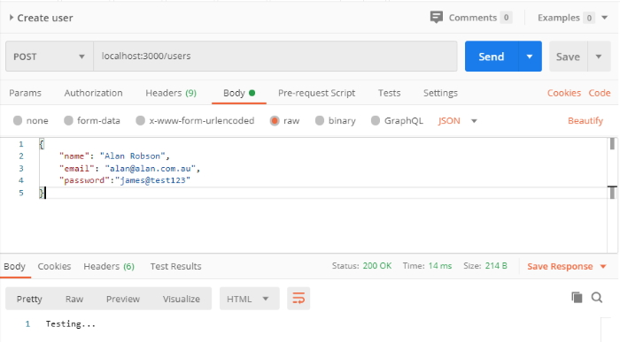
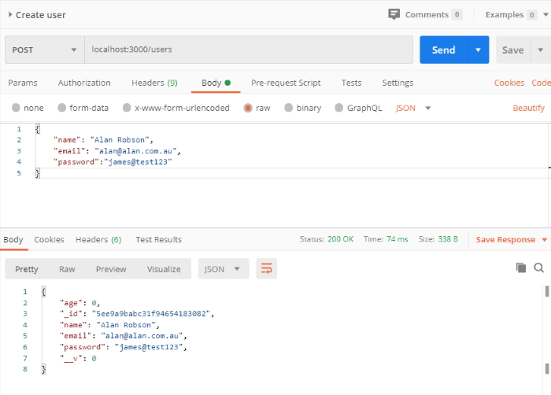
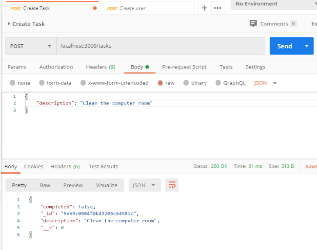
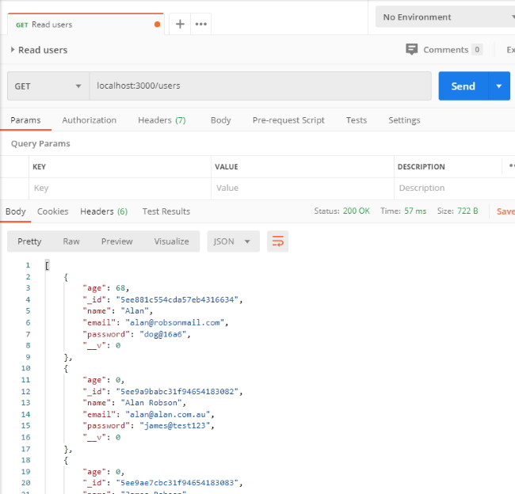
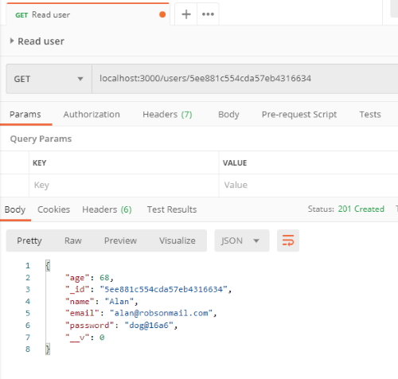
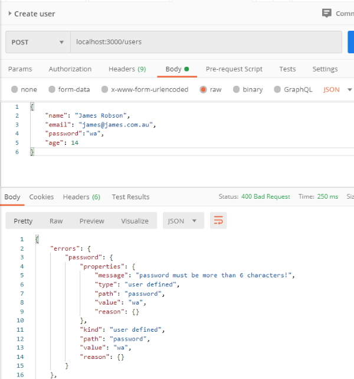
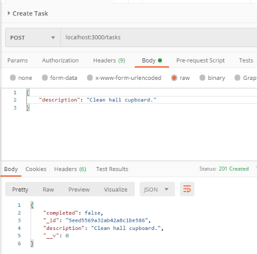
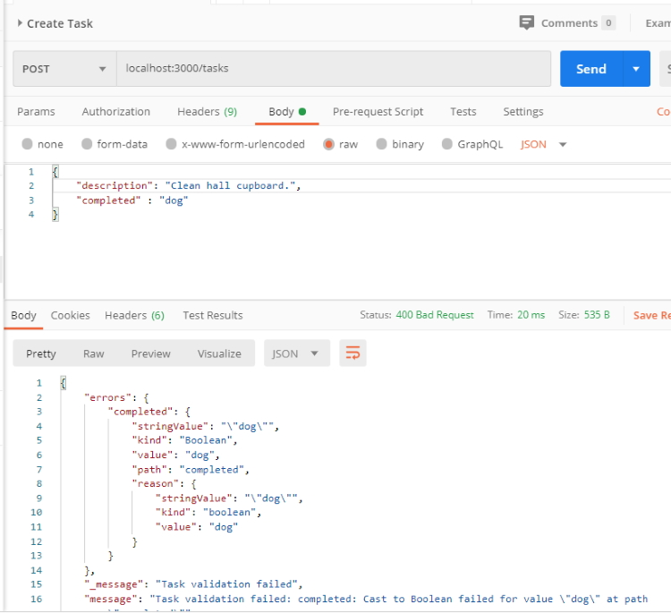
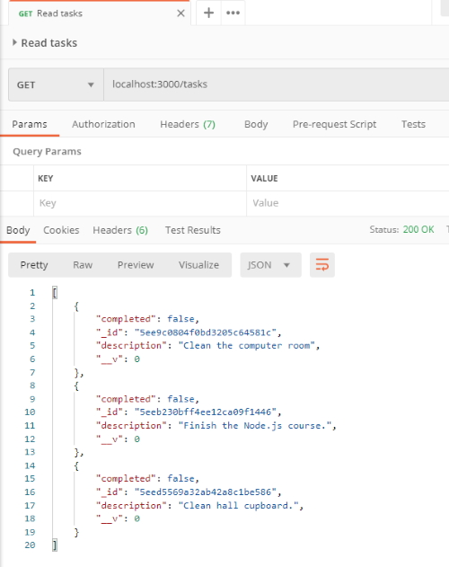
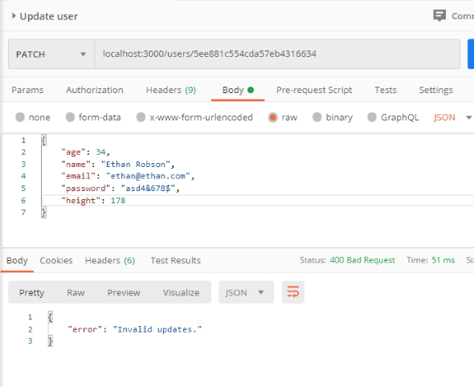

## REST API's and Mongoose

In this section, you'll be creating a REST API using Express. You'll learn what exactly a
REST API is and how it can be used as the back-end for a web or mobile application. This
section also covers data validation, application architecture, async/await, and more.

### Setting up Mongoose

We need to set up Mongoose. Mongoose makes it easy to model and manage your application data. This includes data sanitization, data validation, and more.

Mongoose will serve as a replacement for the native driver, providing you with a more
object-oriented interface.

[Mongoose Documentation](https://mongoosejs.com/docs/guide.html "Mongoose Documentation").

#### Installing Mongoose

```
    npm i mongoose
```

Like the MongoDB native driver, Mongoose provides a connect function you can use to connect to your MongoDB database.

```
    mongoose.connect('mongodb://127.0.0.1:27017/task-manager-api', {
        useUnifiedTopology: true,
        useCreateIndex: true
    });
```

### Modeling Your Data

The core feature of Mongoose is the ability to model your data. A new model can be created for the different types of data your application needs to store. You can create as many models as your application needs.

The code below defines a user model. The model definition is where you define what makes up a user. This would include all the pieces of data you want to store in the database. The user model below has just two fields, a name and an age.

```
    const User = mongoose.model('User', {
        name: {
            type: String
        },
        age: {
            type: Number
        }
    });
```

With the model defined, it's time to start creating and saving users. The User variable above stores the Mongoose model. This is a constructor function that can be used to create new users. The snippet below creates a new user with the name 'Alan' and the age 68. This alone won't save any data to the database, but it's a step in the right direction.

```
    const me = new User({
        name: 'Alan',
        age: 68
    })
```

The new model instance can be saved to the database using the ``save`` method.

```
    me.save().then(() => {
        console.log(me);
    }).catch((error) => {
        console.log('Error!', error)
    });
```

> { _id: 5ee725d11bfdfb4b10c044f6, name: 'Alan', age: 68, __v: 0 }

When you ``save()`` a document it returns a promise so you can set your code up with success/error handlers.

**Note:** It is not explicitly stated but you are creating a new database named **task-manager-api** if it doesn't already exist.

**Note:** You create a **User** model (singular) and this in turn creates a collection (plural) named **users** when you save your first document. Once again you don't have to specify the name of the collection.

##### Challenge

Create a model for tasks

1. Define the model with description (String) and completed (Boolean) fields.
2. Create a new instance of the model.
3. Save the model to the database.
4. Test your work.

```
    // Define the model.
    const Task = mongoose.model('Task', {
        description: {
            type: String
        },
        completed: {
            type: Boolean
        }
    });

    // Create a new instance of the model.
    const myTask = new Task({
        description: 'Take out the rubbish', 
        completed: false
    });

    // Save the model to the database.
    myTask.save().then(() => {
        console.log(myTask);
    }).catch((error) => {
        console.log('Error!',error);
    });
```

> { _id: 5ee8622e8c610079705ad730,   
>   description: 'Take out the rubbish',   
>   completed: false,  
>   __v: 0 }   

### Data Validation and Sanitization: Part I

We are now going to set up data validation and sanitization for our models. Validation will allow us to restrict what data can be stored in the database, while sanitization will allow us to store user data in a uniform and standardized way.

#### Data Validation and Sanitization

Mongoose provides basic validation for our fields. Below we are requiring a value for ``name`` but not for ``age``. We also validate the ``age`` field to make sure it is a positive number.

```
    const User = mongoose.model('User', {
        name: {
            type: String,
            required: true
        },
        age: {
            type: Number,
            validate(value) {
                if (value < 0) {
                    throw new Error('Age must be a positive number!');
                }
            }
        }
    });

    const me = new User({
        name: 'James'
    }); 

    me.save().then(() => {
        console.log(me);
    }).catch((error) => {
        console.log('Error!',error);
    });
```

> { _id: 5ee86a2a5a21e474accffe48, name: 'James', __v: 0 }

As you can see it allows us to leave the ``age`` field off.

We can add a negative number to ``age``.

```
    const me = new User({
        name: 'James',
        age: -1
    }); 
```

You see the following error and the faulty document isn't added to the collection.

> kind: 'user defined',  
>         path: 'age',  
>         value: -1,  
>         reason:  
>          Error: Age must be a positive number!  

When it comes to needing more complex validation we need to use a trusted library. We will install **validator**. While Mongoose provides basic tools for performing validation, the **validator** library provides useful methods for validating data such as email addresses, phone numbers, zip codes, and more.

```
    npm i validator
```

[The Validator Documentation](https://www.npmjs.com/package/validator "The Validator Documentation").


The user model below shows how this can be configured. ``required`` is used to validate that a value is provided for a given field. ``trim`` is used to remove extra spaces before or after data. ``lowercase`` is used to convert the data to lowercase before saving it to the database. You can find a complete list of options in the schema documentation.

You can also define custom validation for your models. This is done using validate as shown in the example below. The method gets called with the value to validate, and it should throw an error if the data is invalid. The example below uses the ``isEmail`` method from validator to validate the email address is valid before saving it to the database.

```
    const mongoose = require('mongoose');
    const validator = require('validator');

    mongoose.connect('mongodb://127.0.0.1:27017/task-manager-api', {
        useNewUrlParser: true,
        useCreateIndex: true
    });

    const User = mongoose.model('User', {
        name: {
            type: String,
            required: true
        },
        email: {
            type: String,
            required: true,
            validate(value) {
                if (!validator.isEmail(value)) {
                    throw new Error('Failed to provide a valid email address!');
                }
            }
        },
        age: {
            type: Number,
            validate(value) {
                if (value < 0) {
                    throw new Error('Age must be a positive number!');
                }
            }
        }
    });

    const me = new User({
        name: 'Alan',
        email: 'alan@robsonmail.com',
        age: 68
    });

    me.save().then(() => {
        console.log(me);
    }).catch((error) => {
        console.log('Error!',error);
    });
```

> { _id: 5ee873b6c65c3b52cca4db80,  
>   name: 'Alan',  
>   email: 'alan@robsonmail.com',  
>   age: 68,  
>   __v: 0 }  

We are going to add some more validation to our collection. Before we run this clean out all current documents from the collection.

```
    const User = mongoose.model('User', {
        name: {
            type: String,
            required: true,
            trim: true
        },
        email: {
            type: String,
            required: true,
            trim: true,
            lowercase: true,
            validate(value) {
                if (!validator.isEmail(value)) {
                    throw new Error('Failed to provide a valid email address!');
                }
            }
        },
        age: {
            type: Number,
            default: 0,
            validate(value) {
                if (value < 0) {
                    throw new Error('Age must be a positive number!');
                }
            }
        }
    });

    const me = new User({
        name: ' Alan   ',
        email: 'Alan@Robsonmail.Com'
    }); 

    me.save().then(() => {
        console.log(me);
    }).catch((error) => {
        console.log('Error!',error);
    });
```

> age: 0,  
>  _id: 5ee87681e8183e68685356f6,  
>  name: 'Alan',  
>  email: 'alan@robsonmail.com',  
>  __v: 0 }  

Note that we have an ``age`` value of 0. The ``email`` field has been changed to lowercase and the ``name`` field has had all of the spaces removed.

##### Challenge

Add a password field to User.

1. Setup the field as a required string.
2. Ensure that the length is greater than 6 characters.
3. Trim the password.
4. Ensure that the password doesn't contain the word "password".
5. Test your work.

```
    const User = mongoose.model('User', {
        name: {
            type: String,
            required: true,
            trim: true
        },
        age: {
            type: Number,
            default: 0,
            validate(value) {
                if (value < 0) {
                    throw new Error('Age must be a positive number!');
                }
            }
        },
        email: {
            type: String,
            required: true,
            trim: true,
            lowercase: true,
            validate(value) {
                if (!validator.isEmail(value)) {
                    throw new Error('Failed to provide a valid email address!');
                }
            }
        },
        password: {
            type: String,
            required: true,
            trim: true,
            validate(value) {
                if (!validator.isLength(value, {min: 7, max: undefined})) {
                    throw new Error('password must be more than 6 characters!');
                } else if (validator.contains(value, 'password')) {
                    throw new Error('Invalid password!');
                }
            }
        }
    });

    const me = new User({
        name: ' Alan   ',
        age: 68,
        email: 'Alan@Robsonmail.Com',
        password: 'dog@16a6'
    });

    me.save().then(() => {
        console.log(me);
    }).catch((error) => {
        console.log('Error!',error);
    });
```

> { age: 68,  
>   _id: 5ee881c554cda57eb4316634,  
>   name: 'Alan',  
>   email: 'alan@robsonmail.com',  
>   password: 'dog@16a6',  
>   __v: 0 }  

Test for invalid password.

```
    const me = new User({
        name: ' Alan   ',
        age: 68,
        email: 'Alan@Robsonmail.Com',
        password: ' Dog@  '
    });
```

>kind: 'user defined',  
>        path: 'password',  
>        value: 'Dog@',  
>        reason:  
>         Error: password must be more than 6 characters!  

```
    const me = new User({
        name: ' Alan   ',
        age: 68,
        email: 'Alan@Robsonmail.Com',
        password: 'Password'
    });
```

> kind: 'user defined',  
>         path: 'password',  
>         value: 'Password',  
>         reason:  
>          Error: Invalid password!  

##### Challenge

Add validation and sanitisation to Task.

1. Trim the description and make it required.
2. Make completed optional and default it to true.
3. Test your work.

```
    const Task = mongoose.model('Task', {
        description: {
            type: String,
            required: true,
            trim: true
        },
        completed: {
            type: Boolean,
            default: true
        }
    });

    const myTask = new Task({
        description: '  Take out the rubbish  '
    });

    myTask.save().then(() => {
        console.log(myTask);
    }).catch((error) => {
        console.log('Error!',error);
    });
```

> { completed: true,  
>   _id: 5ee88528395f1d5d206dc987,  
>   description: 'Take out the rubbish',  
>   __v: 0 }  

### The task manager application

In task-manager install the following.

```
    npm i nodemon --save-dev

    npm i express
```

We are going to change **package.json**.

```
    "devDependencies": {
        "nodemon": "^2.0.4"
      },
        "scripts": {
        "start": "node src/index.js",
        "dev": "nodemon src/index.js"
      },
```

Start the Express server.

```
    npm run dev
```

Create an ``index.js`` in the **src** folder.

```
    const express = require('express');
    const { response } = require('express');

    const app = express();
    const port = process.env.PORT || 3000;

    app.post('/users', (req, res) => {
        res.send('Testing...');
    });

    app.listen(port, () => {
        console.log('Server is up on port ' + port);
    });
```

To start off with we are just going to send a message that we are testing.

Now, we are going to open Postman and set up a request.

First, create a new collection, **Task app** and then create a new request, **Create user**.

Change the request to a **Post**. and the url is ``localhost:3000/users`` to match what we set up in index.js.

Now, save the request and click send. This image below is what we see in Postman.


Now, we can set up a new user in Postman by clicking on **body**, Then selecting **raw** and setting the results to **JSON**.

Now, in the body section type in the following.

```
{
    "name": "Alan Robson",
    "email": "alan@alan.com.au",
    "password":"james@test123" 
}
```

**Note:** we have to use double quotes in this JSON.

Now click on **send** again.



We still get our *testing...* message but you will see ``Status: 200 Ok`` to let you know that the JSON was sent correctly.

Now, the big question is how do we use this to actually send a new user into the database? Change the code to:

```
    const express = require('express');

    const app = express();
    const port = process.env.PORT || 3000;

    app.use(express.json());

    app.post('/users', (req, res) => {
        console.log(req.body);
        res.send('Testing...');
    });

    app.listen(port, () => {
        console.log('Server is up on port ' + port);
    });
```

Go back to Postman and click **send** again. We won't see any changes in Postman but if you look at your terminal you should see the data that you added into Postman.


Now, we can need to set up a model in a new **models** folder. We will create a user model.

##### src/models/user.js

```
    const mongoose = require('mongoose');
    const validator = require('validator');

    const User = mongoose.model('User', {
        name: {
            type: String,
            required: true,
            trim: true
        },
        age: {
            type: Number,
            default: 0,
            validate(value) {
                if (value < 0) {
                    throw new Error('Age must be a positive number!');
                }
            }
        },
        email: {
            type: String,
            required: true,
            trim: true,
            lowercase: true,
            validate(value) {
                if (!validator.isEmail(value)) {
                    throw new Error('Failed to provide a valid email address!');
                }
            }
        },
        password: {
            type: String,
            required: true,
            trim: true,
            validate(value) {
                if (!validator.isLength(value, {min: 6, max: undefined})) {
                    throw new Error('password must be more than 6 characters!');
                } else if (validator.contains(value.toLowerCase(), 'password')) {
                    throw new Error('Invalid password!');
                }
            }
        }
    });

    module.exports = User;
```

We have to import ``User`` into index.js.

We also have to import ``./models/mongoose`` because that has our database connection.

##### src/index.js

```
    const express = require('express');
    const User = require('./models/user');

    require('./db/mongoose');

    const app = express();
    const port = process.env.PORT || 3000;

    app.use(express.json());

    app.post('/users', (req, res) => {
        const user = new User(req.body);
        user.save().then(() => {
            res.send(user);
        }).catch((e) => {
            res.status(400);
            res.send(e);
        });;
    });

    app.listen(port, () => {
        console.log('Server is up on port ' + port);
    });
```

##### src/db/mongoose.js

```
    const mongoose = require('mongoose');

    mongoose.connect('mongodb://127.0.0.1:27017/task-manager-api', {
        useNewUrlParser: true,
        useCreateIndex: true
    });
```

If we go over to Postman we will see the response that we get back.



Now, if we check the database we will see.

> /* 1 */  
> {  
>     "_id" : ObjectId("5ee9a9babc31f94654183082"),  
>     "age" : 0,  
>     "name" : "Alan Robson",  
>     "email" : "alan@alan.com.au",  
>     "password" : "james@test123",  
>     "__v" : 0  
> }  

The document was successfully added to the database.

Also, at this stage we have created our first rest API route.

What happens if we add incorrect data and cause an error? We can shorten the email address to 2 characters to force an error.

In Postman we get the following error and the document won't be added to the collection in the database.


Note that we can see a ``400 Bad request`` error in the response. This is because we set up the status in the **catch** statement.

We can get a [list of status numbers](https://httpstatuses.com "list of status numbers") here.

##### Challenge

Set up the Task creation endpoint.

1. Create a separate file for the Task model (load it into index,js).
2. Create the Task creation endpoint (handle success and error).
3. Test the endpoint from Postman with good and bad data.

##### src/models/task.js

```
    const mongoose = require('mongoose');
    const validator = require('validator');

    const Task = mongoose.model('Task', {
        description: {
            type: String,
            required: true,
            trim: true
        },
        completed: {
            type: Boolean,
            default: false
        }
    });

    module.exports = Task;
```

##### index.js

```
    const express = require('express');
    const User = require('./models/user');
    const Task = require('./models/task');

    require('./db/mongoose');

    const app = express();
    const port = process.env.PORT || 3000;

    app.use(express.json());

    app.post('/users', (req, res) => {
        const user = new User(req.body);
        user.save().then(() => {
            res.send(user);
        }).catch((e) => {
            res.status(400);
            res.send(e);
        });
    });

    app.post('/tasks', (req, res) => {
        const task = new Task(req.body); 
        task.save().then(() => {
            res.send(task);
        }).catch((e) => {
            res.status(400).send(e);
        });
    });

    app.listen(port, () => {
        console.log('Server is up on port ' + port);
    });
```

**Note:** I couldn't get this working and couldn't find an error in my code. I had a look at Postman and noticed that I had a **get** instead of a **post**. I'll have to watch out for this in future when creating and testing endpoints.

**Note:** I have chained the ``status`` and the ``send`` methods in the Task creation endpoint.

##### Results

A successful post.



A failure.


### Status codes

We have added a status code of ``400`` for our error handling and we can also add one for our success handling as well.

We are allowing Postman to send a generic ``200`` code but we can be more accurate with the following code.

```
    201 Created
```

We will change our endpoints to reflect this.

```
    app.post('/users', (req, res) => {
        const user = new User(req.body);
        user.save().then(() => {
            res.status(201).send(user);
        }).catch((e) => {
            res.status(400).send(e);
        });
    });

    app.post('/tasks', (req, res) => {
        const task = new Task(req.body);
        task.save().then(() => {
            res.status(201).send(task);
        }).catch((e) => {
            res.status(400).send(e);
        });
    });
```

### Resource Reading Endpoints: Part I

Now we will learn how to create REST API endpoints for reading resources. This will allow users of the API to fetch users and tasks from the database.

#### Resource Reading Endpoints

Resource reading endpoints use the **GET** HTTP method. The URL structure is **/resources**
for a list of resources and **/resources/:id** for fetching an individual resource by its ID. If
you wanted to fetch all your tasks, it would be **GET /tasks**. If you wanted to fetch an
individual task with the ID of 198, it would be **GET /tasks/198**.

We can set up a ``app.get`` request to return all of the users.

```
    app.get('/users', (req, res) => {
        User.find({}).then((users) => {
            console.log(res.send(users));
        }).catch((e) => {
            res.status(500).send();
        });
    });
```

Now, we will set up a Postman request to test our endpoint.

Create a new request named **Read users** with an endpoint of GET localhost:3000/users and click send.



The code below uses **app.get** to set up a GET request handler for **/users/:id**. :id serves as a placeholder for the ID of the user to fetch. If the request is **GET /users/321**, then the ID will be 321. This is known as a URL parameter, and you can access the value for URL parameters on **req.params**.

```
    app.get('/users/:id', (req, res) => {
        User.findOne({}).then((users) => {
            console.log(req.params);
    });
```

At the moment we will use the following for testing.

```
    console.log(req.params);
```

We will create a Postman request to test our endpoint and just send some rubbish data.

GET localhost:3000/users/123456789

This will time out in Postman because we haven't set up any data to be returned in the response but if you look in the terminal you will see the following log.

> { id: '123456789' }

which is our **req.params** value.

We can set up the endpoint to bring back some real data now.

```
    app.get('/users/:id', (req, res) => {
        User.find({}).then((users) => {
            const _id = req.params.id;

            User.findById(_id).then((user) => {
                if (!user) {
                    res.status(404).send();
                }

                res.send(user);
            }).catch((e) => {
                res.status(500).send(e);
            });
        });
    });
```

**Note:** we don't have to change the string _id value into an object. Mongoose does that for us,

Now we will add a real user id into Postman and see what we get back.



##### Challenge

Set up the task reading endpoints.

1. Create the endpoint for fetching all of the tasks.
2. Create the endpoint for fetching one task by its id.
3. Set up a new request in Postman to test your work.

##### tasks

```
	app.get('/tasks', (req, res) => {
		Task.find({}).then((tasks) => {
			console.log(res.send(tasks));
		}).catch((e) => {
			res.status(500).send();
		});
	});
```


##### task

```
    app.get('/tasks/:id', (req, res) => {
        const _id = req.params.id;
        Task.findById(_id).then((task) => {
            if (!task) {
                res.status(404).send();
            }
            res.send(task);
        }).catch((e) => {
            res.status(500).send();
        });
    });
```


### Promise Chaining

We are now going to explore promise chaining. Promise chaining is a syntax that allows you to chain together multiple asynchronous tasks in a specific order. This is great for complex code where one asynchronous task needs to be performed after the completion of a different asynchronous task.

We create a single promise to add two numbers together. We simulate an API call with a setTimeout() method.

```
    const add = (a, b) => {
        return new Promise((resolve, reject) => {
            setTimeout(() => {
                resolve(a + b);
            }, 2000);
        });
    }

    add(1, 2).then((sum) => {
        console.log(sum);
    }).catch((e) => {
        console.log(e);
    });
```

What if we wanted to add the sum of the add computation to another number. We could do it the long way by calling another add function as we do below.

```
    const add = (a, b) => {
        return new Promise((resolve, reject) => {
            setTimeout(() => {
                resolve(a + b);
            }, 2000);
        });
    }

    add(1, 2).then((sum) => {
        console.log(sum);
        add(sum, 3).then((sum2) => {
            console.log(sum2);
        }).catch((e) => {
            console.log(e);
        });
    }).catch((e) => {
        console.log(e);
    });
```

There is a problem with this code. The problem is that the more we nest our asynchronous tasks the more complex the code gets. At the moment we are two asynchronous tasks deep and this would get more complex if we wanted to do another add task. We are also adding multiple ``catch``'s where they aren't needed.

Promise chaining is a better way to do this.

Promise chaining occurs when the ``then`` callback function returns a promise. This allows you to chain on another ``then`` call which will run when the second promise is fulfilled. ``catch`` can still be called to handle any errors that might occur along the way.

```
    add(1, 2).then((sum) => {
        console.log(sum);
        return add(sum, 3);
    }).then((sum2) => {
        console.log(sum2);
    }).catch((e) => {
        console.log(e);
    });
```

The nice thing about promise chaining is that the code above is not nested. I could chain the add() call 100 times and it would still work without becoming e.

The other nice thing is that there is only one call to ``catch()`` that catches all of the errors.

Let's try this out in our task-manager-api.

We are going to search for a user and update the users age to 1. We are then going to use promise chaining to get the count of the number of user's with the age of 1.

```
    const mongoose = require('../src/db/mongoose');

    const User = require('../src/models/user');

    User.findByIdAndUpdate('5ee9a9babc31f94654183082', { age: 1 }).then((user) => {
        console.log(user);
        return User.countDocuments({ age: 1 });
    }).then((result) => {
        console.log(result);
    }).catch((e) => {
        console.log(e);
    });
```

> { age: 0,  
>   _id: 5ee9a9babc31f94654183082,  
>   name: 'Alan Robson',  
>   email: 'alan@alan.com.au',  
>   password: 'james@test123',  
>   __v: 0   
> }  
>  
> 1  

We are getting the wrong age value but if we look in the database we will see that the age has been set to 1. We are also getting the count of one user with the age of 1.

We are going to get another user with an age of 0 and add that id to our code and run the process again.

This time we get the count of two users with the age of 1. and that user has been updated in the database.

> { age: 0,  
>   _id: 5ee9ae7cbc31f94654183083,  
>   name: 'James Robson',  
>   email: 'james@james.com.au',  
>   password: 'wasc@esdf^st123',  
>   __v: 0  
> }  
>  
> 2  

We are also getting this deprecation message in the output.

> DeprecationWarning: Mongoose: `findOneAndUpdate()` and `findOneAndDelete()` without the `useFindAndModify` option set to false are deprecated. See: https://mongoosejs.com/docs/deprecations.html#findandmodify

This is Mongoose not being up to date. We can ignore these messages or add a new line into our database connection code.

##### /src/db/mongoose.js

```
    const mongoose = require('mongoose');

    mongoose.connect('mongodb://127.0.0.1:27017/task-manager-api', {
        useNewUrlParser: true,
        useCreateIndex: true,
        useFindAndModify: false
    });
```

If we get another user Id to update and run the process again you will notice that we don't get the message again.

##### Challenge

Use promise chaining

1. Create promise-chaining-2.js
2. Load in Mongoose and task model.
3. Remove a given task by id.
4. Get and print the number of incomplete tasks.
5. Test your work.

##### promise-chaining-2.js

```
    const mongoose = require('../src/db/mongoose');

    const Task = require('../src/models/task');

    Task.deleteOne({ _id: '5eec5cc844e10e363439b080' }).then((task) => {
        console.log(task);
        return Task.countDocuments({ completed: false });
    }).then((result) => {
        console.log(result);
    }).catch((e) => {
        console.log(e);
    });
```

> { completed: true,  
>   _id: 5eec5cc844e10e363439b080,  
>   description: 'Take out the rubbish.',  
>   __v: 0  
> }  
>  
> 3  

The document has been deleted from the database and the number of unfinished tasks is 3.

### Async/Await

We are going to learn how to use async and await. These provide an improved syntax for working with promises. You’ll be able to write complex asynchronous code that looks like normal synchronous code. This makes it much easier to write and maintain asynchronous code.

#### Exploring Async/Await

The example below uses the ``add`` function that was created previously. The first step to using async and await is to create an asynchronous function. This is done using the ``async`` keyword before the function definition. This can be seen in the definition of ``doWork`` below. Any function can be defined as an asynchronous function, not just arrow functions.

With an async function in place, you can now use the ``await`` operator. The ``await`` operator can only be used inside of asynchronous functions. This removes the need for excess callbacks and makes code much easier to read.

The ``await`` operator is used with promises in asynchronous functions. You can see this used three times in ``doWork``. The await operator allows you to work with promises in a way that looks like synchronous code. If the promise is fulfilled, the fulfilled value can be accessed as the return value from the function. If the promise is rejected, it would be as though the function threw an error. ``await`` will pause the function execution until the promise is either fulfilled or rejected.

We are going to create a basic arrow function with no return statement and then call it from below.

```
    const doWork = () => {

    }

    console.log(doWork());
```

If we run this we know it will return an **undefined**.

Now, change the function by adding the ``async`` keyword before the start of the arrow function.

```
    const doWork = async () => {

    }

    console.log(doWork());
```

Now, when we run this we get

> Promise { undefined }

So we have set up an asynchronous function and these functions always return a promise and this promise is fulfilled with an **undefined**.

So now let's explicitly return something.

const doWork = async () => {
    return 'Alan';
}

console.log(doWork());

We get the following returned.

> Promise { 'Alan' }

As we said before ``async`` functions always return a Promise. So what we are seeing here is not a string ('Alan') but a Promise that has been fulfilled with the string 'Alan'.

So now we can add a ``then`` and ``catch`` to our promise instead of returning the console.log() statement.

```
    const doWork = async () => {
        return 'Alan';
    }

    doWork().then((name) => {
        console.log(name);
    }).catch((e) => {
        console.log(e);
    });
```

It now returns a string.

> Alan

So now lets run the program by throwing an error to see what ``catch`` returns.

```
    const doWork = async () => {
        throw new Error('Something went wrong.');
        return 'Alan';
    }

    doWork().then((name) => {
        console.log(name);
    }).catch((e) => {
        console.log(e);
    });
```

Returns:

> Error: Something went wrong.

We are now at the stage of using the ``await`` operator. First thing is that the ``await`` operator can only be used with async functions.

Let's grab some code we created previously and add it to our async code.

```
    const add = (a, b) => {
        return new Promise((resolve, reject) => {
            setTimeout(() => {
                resolve(a + b);
            }, 2000);
        });
    }

    const doWork = async () => {
        const sum = await add(1, 99);
        return sum;
    }

    doWork().then((result) => {
        console.log('Result', result);
    }).catch((e) => {
        console.log(e);
    });
```

As you can see our code has been simplified to get the result. The code looks like synchronous code but it is actually asynchronous code.

Let's add another number as in our previous example and then we will add another number again.

```
    const add = (a, b) => {
        return new Promise((resolve, reject) => {
            setTimeout(() => {
                resolve(a + b);
            }, 2000);
        });
    }

    const doWork = async () => {
        const sum = await add(1, 99);
        const sum2 = await add(sum, 2);
        const sum3 = await add(sum2, 2);
        return sum3;
    }

    doWork().then((result) => {
        console.log('Result', result);
    }).catch((e) => {
        console.log(e);
    });
```

The program waits 6 seconds and then returns.

> Result 104

This code is much simpler that our previous promise code which is shown below.

```
    add(1, 2).then((sum) => {
        console.log(sum);
        return add(sum, 3);
    }).then((sum2) => {
        console.log(sum2);
    }).catch((e) => {
        console.log(e);
    });
```

This example using promise chaining only sums two sets of numbers but looks a lot more complicated than our new async/await code example. It is also easier to make mistakes with.

Another problem with promise chaining is that it is harder to keep your code in scope. It is harder to keep all variables in scope if we want to add these to a database. We would have to create external variables and set each external variable after we got each value from the promise chaining. In our async/await all variables are available all of the time the function is in scope making it easier to send all variables to the database.

Going back to our async/await example we need to be able to handle if one of our promises rejects instead of fulfills.

We are going to add some code to stop users from entering negative numbers. If they do we want to reject the promise and stop processing.

```
    const add = (a, b) => {
        return new Promise((resolve, reject) => {
            setTimeout(() => {
                if (a < 0 || b < 0) {
                    return reject('Numbers must be positive');
                }

                resolve(a + b);
            }, 2000);
        });
    }

    const doWork = async () => {
        const sum = await add(-1, 99);
        const sum2 = await add(sum, 2);
        const sum3 = await add(sum2, 2);
        return sum3;
    }

    doWork().then((result) => {
        console.log('Result', result);
    }).catch((e) => {
        console.log('Error', e);
    });
```

The first number is negative so prints out this message after two seconds have passed. This stops the processing.

> Error Numbers must be positive

We are now going to update our promise chaining examples to use async/await. We start with the users example.

```
    const updateAgeAndCount = async (id, age) => {
        const user = await User.findByIdAndUpdate(id, { age });
        const count = await User.countDocuments({ age });
        return count;
    }

    updateAgeAndCount('5ee881c554cda57eb4316634', 2).then((result) => {
        console.log(result);
    }).catch((e) => {
        console.log(e);
    });
```

These are the results in the database:

> /* 1 */  
> {  
>     "_id" : ObjectId("5ee881c554cda57eb4316634"),  
>     "age" : 2,  
>     "name" : "Alan",  
>     "email" : "alan@robsonmail.com",  
>     "password" : "dog@16a6",  
>     "__v" : 0  
> }  

We get one user with the age of 2.

We can run this again with a different user id ('5ee9a9babc31f94654183082').

> /* 2 */  
> {  
>     "_id" : ObjectId("5ee9a9babc31f94654183082"),  
>     "age" : 2,  
>     "name" : "Alan Robson",  
>     "email" : "alan@alan.com.au",  
>     "password" : "james@test123",  
>     "__v" : 0  
> }  

Now we get two users with the age of 2.

##### Challenge

Use async/await

1. Create deleteTaskAndCount as an async function.
2. Use await to delete a task and count up incomplete tasks.
3. Return the count.
4. Call the function and attach then/catch to log results.
5. Test your work.

```
    const deleteTaskAndCount = async (id) => {
        const task = await Task.findByIdAndDelete(id);
        const count = await Task.countDocuments({ completed: false });

        return count;
    };

    deleteTaskAndCount('5eeb2374ff4ee12ca09f1447').then((count) => {
        console.log(count);
    }).catch((e) => {
        console.log(e);
    });
```

The task has been deleted from the database and the number of incomplete tasks = 2.

Our next job is to add async/await to our user and task route handlers in task manager.

##### POST new user route handler

```
    app.post('/users', async (req, res) => {
        const user = new User(req.body); 

        try {
            await user.save();
            res.status(201).send(user);  
        } catch (e) {
            res.status(400).send(e);  
        }
    });
```

To test this out open up Postman and click on the **Create user** request. First, use a short password to generate an error.



Now add a valid email address.


Record created in the database.

> /* 5 */  
> {  
>     "_id" : ObjectId("5eed4d6adf99b71fdcaf2fc4"),  
>     "age" : 14,  
>     "name" : "James Robson",  
>     "email" : "james@james.com.au",  
>     "password" : "waas5%46$ep&",  
>     "__v" : 0  
> }  

##### GET users route handler

```
    app.get('/users', async (req, res) => {
        try {
            const users = await User.find({});
            res.send(users);
        } catch (e) {
            res.status(500).send();
        }
    });
```


##### GET user by id route handler

```
    app.get('/users/:id', async (req, res) => {
        const _id = req.params.id;

        try {
            const user = await User.findById(_id);

            if (!user) {
                return res.status(404).send();
            }

            res.send(user);
        } catch (e) {
            res.status(500).send();
        }
    });
```


We use an ``if()`` condition to test if a user was found. If not, send back a ``404``.

##### Challenge

1. Add async/await to Task route handlers.
2. Test your work in Postman.

##### POST task route handler

```
    app.post('/tasks', async (req, res) => {
        const task = new Task(req.body); 

        try {
            await task.save();
            res.status(201).send(task);
        } catch (e) {
            res.status(400).send(e);
        }
    });
```

Results in Postman.



Results in database.

> /* 3 */  
> {  
>     "_id" : ObjectId("5eed5569a32ab42a8c1be586"),  
>     "completed" : false,  
>     "description" : "Clean hall cupboard.",  
>     "__v" : 0  
> }  

##### Postman 'Create task' error message



##### GET all tasks route handler

```
    app.get('/tasks', async (req, res) => {
        try {
            const tasks = await Task.find({});
            res.send(tasks);
        } catch (e) {
            res.status(500).send();
        }
    });
```

Postman results



##### Get Task route handler

```
    app.get('/tasks/:id', async (req, res) => {
        const _id = req.params.id;

        try {
            const task = await Task.findById(_id);

            if (!task) {
                return res.status(404).send();
            }

            res.send(task);
        } catch (e) {
            res.status(500).send();
        }
    });
```

Postman results.

")

### Resource Updating Endpoints: Part I

We are now going to learn how to create REST API endpoints for updating resources. This will allow users of the API to update users and tasks that are already in the database.

Resource updating endpoints use the PATCH HTTP method. The URL structure is **/resources/:id** for updating an individual resource by its ID. If you want to update an individual task with the ID of 44, it would be **PATCH /tasks/44**. 

``app.patch`` is used to set up the Express route handler.

```
    app.patch('/users/:id', async (req, res) => {
        // Route handler code here
    });
```

When working with updates, it’s a good idea to alert the user if they’re trying to update something that they can’t update. The code below checks that the user is only updating fields that can be updated, otherwise it will send back an error response.

```
    const updates = Object.keys(req.body);
    const allowedUpdates = ['name', 'email', 'password', 'age'];

    const isValidOperation = updates.every((update) => allowedUpdates.includes(update));

    if (!isValidOperation) {
        return res.status(400).send({ error: 'Invalid updates!' })
    }
```

If all goes well, the updates will be applied to the user, then a response will be sent back.

If the provided updates are valid, **findByIdAndUpdate** can be used to update the document in the database. ``Try/catch`` is used here to send back an error if something goes wrong when updating the user. This would include the new data not passing the validation defined for the model.

```
    try {
        const user = await User.findByIdAndUpdate(req.params.id, req.body, { new: true, runValidators: true });

        if (!user) {
            return res.status(404).send();
        }

        res.send(user);
    } catch (e) {
        res.status(400).send(e);
    }
```

##### Final PATCH (update) user by id

```
    const updates = Object.keys(req.body); 
    const allowedUpdates = ['name', 'email', 'password', 'age'];

    const isValidOperation = updates.every((update) => allowedUpdates.includes(update));

    if (!isValidOperation) {
        return res.status(400).send({error: 'Invalid updates.'});
    }

    app.patch('/users/:id', async (req, res) => { 
        try {
            const user = await User.findByIdAndUpdate(req.params.id, req.body, { new: true, runValidators: true });

            if (!user) {
                return res.status(404).send();
            }

            res.send(user);
        } catch (e) {
            res.status(400).send(e);
        }
    });
```

**Note:** once again you have to remember to set Postman to **PATCH**.

What happens if somebody tries to update the id or tries to add a field that doesn't exist?

We have added the following code to trap this.

```
    const updates = Object.keys(req.body);
    const allowedUpdates = ['name', 'email', 'password', 'age'];

    const isValidOperation = updates.every((update) => allowedUpdates.includes(update));

    if (!isValidOperation) {
        return res.status(400).send({error: 'Invalid updates.'});
    }
```

``Object.keys`` gives us back all of the keys in the JSON that is sent.

``updates.every()`` allows us to check every key in the ``res.body`` JSON to make sure that it is in our list of ``allowedUpdates()``. If not, it will send back an error.

This code is information for the user to let them know that there is a problem. Our code would stop invalid data being added to the database.



##### Challenge

Add the Task update route handler.


```
    app.patch('/tasks/:id', async (req, res) => {
        const updates = Object.keys(req.body);
        const allowedUpdates = ['description', 'completed'];

        const isValidOperation = updates.every((update) => allowedUpdates.includes(update));

        if (!isValidOperation) {
            return res.status(400).send({error: 'Invalid updates.'});
        }

        try {
            const task = await Task.findByIdAndUpdate(req.params.id, req.body, { new: true, runValidators: true });

            if (!task) {
                return res.status(404).send();
            }

            res.send(task);
        } catch (e) {
            res.status(400).send(e);
        }
    });
```

##### Postman Task update error


##### Postman Task success


##### Update in database

> /* 2 */  
> {  
>     "_id" : ObjectId("5eeb230bff4ee12ca09f1446"),  
>     "completed" : true,  
>     "description" : "Finish the Complete Node.js course.",  
>     "__v" : 0  
> }  

### Resource Deleting Endpoints

We need to learn how to set up a REST API endpoint for deleting resources. 

#### Deleting Resources

Resource deleting endpoints use the **DELETE HTTP** method. The URL structure is
**/resources/:id** for deleting an individual resource by its ID. If you want to delete an
individual task with the ID of 897, it would be **DELETE /tasks/897**.

``app.delete`` is used to set up the Express route handler.

#### Delete User route

```
    app.delete('/users/:id', async (req, res) => {
        try {
            const user = await User.findByIdAndDelete(req.params.id);

            if (!user) {
                return res.status(404).send();
            }

            res.send(user);
        } catch (e) {
            res.status(500).send();
        }
    });
```

This deleted a task document from the database.

##### Challenge

Create a Task route handler to delete a task.

```
    app.delete('/tasks/:id', async (req, res) => {
        try {
            const task = await Task.findByIdAndDelete(req.params.id);

            if (!task) {
                return res.status(404).send();
            }

            res.send(task);
        } catch (e) {
            res.status(500).send();
        }
    });
```


This deleted a task document from the database.

### Separate Route Files

We are going to learn how to organise your Express application endpoints. Defining all endpoints in a single file is a fine way to get started, but that won’t scale well as you add more routes to the app.

#### Creating Separate Routers

Express allows you to create as many routers as you want. These separate routers can then be combined into a single Express application. You can create a new router using ``express.Router`` as shown below. The example file below creates the router, adds routes, and exports the router from the file.

```
    const router = new express.Router()

    router.post('/someEndpoint', (req, res) => {
        // Do something
    });

    module.exports = router
```

The router defined in the file above can be added into the Express application in index.js. This is done by loading the router in with **require** and then passing the router to ``app.use``. You can set up as many routers as you need for your application, though it’s common to have a router for each distinct resource your REST API has.

```
    // Register with existing application
    app.use(router);
```

We are going to create  a new test route.

```
    const router = new express.Router();

    router.get('/test', (req, res) => {
        res.send('Message from test route.');
    });
```

We can now test this route in the browser with.

> localhost:3000/test

We get the following error.


We have to register our router with our application. We can do this with.

```
    app.use(router);
```
Now we get the following output.


We need to separate this out into another file but first we are going to create a new folder in the **src** folder named **routers**.

Now create a new file named **user.js**. This will store the user route endpoints.

##### /src/routers/user.js

We create this code to test the user router.

```
const express = require('express');

const router = new express.Router();

router.get('/test', (req, res) => {
    res.send('From a new file.');
});

module.exports = router;
```

##### In index.js

Import the user router/

```
    const userRouter = require('./routers/user');
```

Register the user router with the application.

```
    app.use(userRouter);
```

Now, refresh the web page.


Now that we know that the test route endpoint is working we can delete it and move all of the user routes to the **user.js** file.

We are not finished yet. 

The first issue is that we the user routes are using **app.post** and all need to be changed to **router.post**, etc.

The second issue is we need to require the **User** model.

```
    const User = require('../models/user');
```

To test that you have created the new routes correctly go over to Postman and use the ``Read users`` request to make sure it is still working.

##### Challenge

Create the task router.

1. Create a new file that creates and exports the new router.
2. Move all task routes over to the new file.
3. Load in and use that router with the express app.
4. test your work.

##### /src/routers/task.js

This code is for testing to make sure the task router works.

```
    const express = require('express');
    const Task = require('../models/task');
    const router = new express.Router();

    // testing only.
    router.get('/newtest', (req, res) => {
        res.send('From a new task file.');
    });

    module.exports = router;
```

It is working so now we can shift the task route endpoints to the **task.js** file.

Change **app.post** to **router.post**, etc.

Add the following so we can use the task model.

```
    const Task = require('../models/task');
```

Use Postman **Read tasks** request to test that everything is working.

After refactoring we have ended up with a simple index.js file and all of our routes in their respective router files. This is much better than having all of our code in one big JavaScript file.

The **index.js** file is our Express application and gets it up and running but what the application actually does is defined in our two router files. 

##### index.js

```
    const express = require('express');
    const userRouter = require('./routers/user');
    const taskRouter = require('./routers/task');

    require('./db/mongoose');

    const app = express();
    const port = process.env.PORT || 3000;

    app.use(express.json());

    app.use(userRouter);
    app.use(taskRouter);

    app.listen(port, () => {
        console.log('Server is up on port ' + port);
    });
```

##### src/models/user.js

```
    const mongoose = require('mongoose');
    const validator = require('validator');

    const User = mongoose.model('User', {
        name: {
            type: String,
            required: true,
            trim: true
        },
        age: {
            type: Number,
            default: 0,
            validate(value) {
                if (value < 0) {
                    throw new Error('Age must be a positive number!');
                }
            }
        },
        email: {
            type: String,
            required: true,
            trim: true,
            lowercase: true,
            validate(value) {
                if (!validator.isEmail(value)) {
                    throw new Error('Failed to provide a valid email address!');
                }
            }
        },
        password: {
            type: String,
            required: true,
            trim: true,
            validate(value) {
                if (!validator.isLength(value, {min: 6, max: undefined})) {
                    throw new Error('password must be more than 6 characters!');
                } else if (validator.contains(value.toLowerCase(), 'password')) {
                    throw new Error('Invalid password!');
                }
            }
        }
    });

    module.exports = User;
```

##### src/routers/user.js

```
    const express = require('express');
    const User = require('../models/user');
    const router = new express.Router();

    router.post('/users', async (req, res) => {
        const user = new User(req.body); 

        try {
            await user.save();
            res.status(201).send(user);  
        } catch (e) {
            res.status(400).send(e);  
        }
    });

    router.get('/users', async (req, res) => {
        try {
            const users = await User.find({});
            res.send(users);
        } catch (e) {
            res.status(500).send();
        }
    });

    router.get('/users/:id', async (req, res) => {
        const _id = req.params.id;

        try {
            const user = await User.findById(_id);

            if (!user) {
                return res.status(404).send();
            }

            res.send(user);
        } catch (e) {
            res.status(500).send();
        }
    });

    router.patch('/users/:id', async (req, res) => {
        const updates = Object.keys(req.body); 
        const allowedUpdates = ['name', 'email', 'password', 'age'];

        const isValidOperation = updates.every((update) => allowedUpdates.includes(update));

        if (!isValidOperation) {
            return res.status(400).send({error: 'Invalid updates.'});
        }

        try {
            const user = await User.findByIdAndUpdate(req.params.id, req.body, { new: true, runValidators: true });

            if (!user) {
                return res.status(404).send();
            }

            res.send(user);
        } catch (e) {
            res.status(400).send(e);
        }

    });

    router.delete('/users/:id', async (req, res) => {
        try {
            const user = await User.findByIdAndDelete(req.params.id);

            if (!user) {
                return res.status(404).send();
            }

            res.send(user);
        } catch (e) {
            res.status(500).send();
        }
    });

    module.exports = router;
```

**Note:** I'm not going to show the Tasks files because they are similar to the **Users** files.