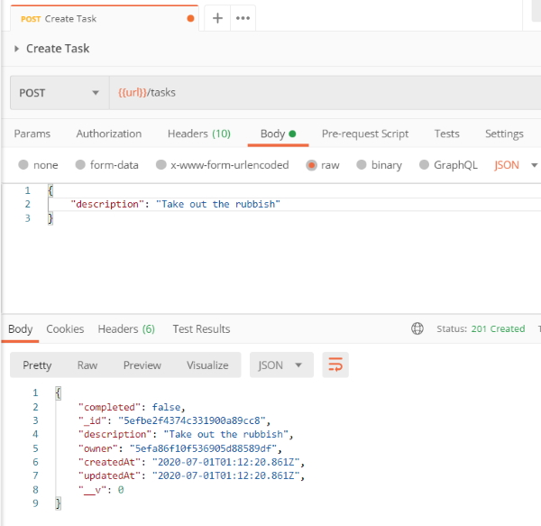

## Sorting, Pagination, and Filtering

### Section Intro

In this section, we'll explore advanced techniques for fetching data. This includes sorting, filtering, and pagination. All three of these will give clients more control over what data they get back. This keeps applications fast, as they don't need to fetch unnecessary data.

### Working with Timestamps

We need to enable timestamps for our Mongoose models. Mongoose will automatically track when documents were created and updated. This is great data to have if you want to allow users to sort by when the document was created or updated.

#### Enabling Mongoose Timestamps

Schema options can be used to enable timestamps. Schema options are provided by passing an object in as the second argument to ``mongoose.Schema``. Set **timestamps** to true to have Mongoose add ``createdAt`` and ``updatedAt`` fields to the model. You don't need to write any code to create or manage those fields, as Mongoose does all that for you.

We add another object at the bottom of the user's schema with one field set to true. This will add the fields to our user collection.

```
        tokens: [{
            token: {
                type: String,
                required: true
            }
        }]
    }, {
        timestamps: true
    });
```

Now that we have done this we have to drop our database again and restart our server.

I create some new users and I can see the timestamps appearing.


Mongoose maintains these timestamps for us so we don't have to write any code to achieve this.

##### Challenge

Refactor task model to add timestamps.

1. Explicitly create schema.
2. Setup timestamps.
3. Create tasks from Postman to test work.

```
    const mongoose = require('mongoose');

    const taskSchema = new mongoose.Schema({
        description: {
            type: String,
            required: true,
            trim: true
        },
        completed: {
            type: Boolean,
            default: false
        },
        owner: {
            type: mongoose.Schema.Types.ObjectId,
            required: true,
            ref: 'User'
        }
    }, {
        timestamps: true
    });

    const Task = mongoose.model('Task', taskSchema);

    module.exports = Task;
```

Results

> {  
>     "completed": false,  
>     "_id": "5efbe2f4374c331900a89cc8",  
>     "description": "Take out the rubbish",  
>     "owner": "5efa86f10f536905d88589df",  
>     "createdAt": "2020-07-01T01:12:20.861Z",  
>     "updatedAt": "2020-07-01T01:12:20.861Z",  
>     "__v": 0  
> }



### Filtering Data

We will use query parameters to allow for data filtering. This will allow clients to fetch all tasks, just the complete tasks, or just the incomplete tasks.

#### Filtering Data

**GET /tasks** below supports a **completed** query parameter which can be set to ``true`` or ``false``. This will prevent clients from fetching unnecessary data that they don't plan on using.

Different endpoints that we can cater for.

```
    {{url}}/tasks

    {{url}}/tasks?completed=true

    {{url}}/tasks?completed=false
```

First up, create an object to store the search criteria.

```
    const match = {};
```

From there, check if the query parameter was provided. The provided value should be parsed into a boolean and stored on **match.completed**.

```
    if (req.query.completed) {
        match.completed = req.query.completed === 'true';
    }
```

In the statement above whatever value is stored in ``req.query.completed`` will be stored in ``match.completed``.

Last up, ``match`` can be added onto populate() to fetch just the users that match the search criteria.

```
    await req.user.populate({
        path: 'tasks',
        match
    }).execPopulate();
```

### Paginating Data

We'll now add pagination to the application. This will allow the client to fetch data in pages. The client can start off with the first page of data and then fetch other pages as they're needed.

#### Data Pagination

Pagination is configured using ``limit`` and ``skip``. These two values give the client complete control of the data they're getting back. 

If a client wanted the first page of 10 tasks, ``limit`` would be set to 10 and ``skip`` would be set to 0. If the client wanted the third page of 10 tasks, ``limit`` would be set to 10 and ``skip`` would be set to 20.
Both ``limit`` and ``skip`` can be added onto the **options** object passed to populate. The code below uses ``parseInt()`` to convert the string query parameters into numbers first.

```
    await req.user.populate({
        path: 'tasks',
        match,
        options: {
            limit: parseInt(req.query.limit),
            skip: parseInt(req.query.skip)
        }
    }).execPopulate();
```

### Sorting Data

Now we will add sorting to the application. Clients will be able to fetch the data back in any order they like.

The **options** object used for pagination can also be used for sorting. A sort property should be set, which is an object containing key/value pairs. The key is the field to sort.

The value is 1 for ascending and -1 for descending sorting.

``GET /tasks`` will get support for a ``sortBy`` query parameter. The value should include the field to sort and the order in which to sort. ``createdAt:asc`` would sort the tasks in ascending order with the oldest first. ``createdAt:desc`` would sort the tasks in a descending order with the newest first.

Start with an empty object to store the sorting options.

```
    const sort = {};
```

If the query parameter is provided, it'll get parsed and ``sort`` will be updated.

```
    if (req.query.sortBy) {
        const parts = req.query.sortBy.split(':');
        sort[parts[0]] = parts[1] === 'desc' ? -1 : 1;
    }
```

``sort`` is then added onto options. If ``sortBy`` isn't provided, sort will be an empty object and no sorting will occur.

```
    await req.user.populate({
        path: 'tasks',
        match,
        options: {
            limit: parseInt(req.query.limit),
            skip: parseInt(req.query.skip),
            sort
        }
    }).execPopulate();
```

We could join all of the filters together.

```
    {{url}}/tasks?completed=false&sortBy=createdAt:asc&limit=2&skip=4
```
