## File Uploads

### Section Intro

We are now going to learn how to configure Node.js to support file uploads. This will allow users to upload documents, profile pictures, and any other file type you might need to support. You'll also see what it takes to store the uploaded files in MongoDB.

### Adding Support for File Uploads

We are going to set up multer. Multer is a library in the Express ecosystem that allows your Express application to easily support file uploads. It couldn't be easier.

#### Configuring Multer

First up, install the library.

```
    npm i multer
```

Multer can then be configured to fit your specific needs. The example below shows off a basic configuration where ``dest`` is set to ``images``. This will store all uploaded files in a directory called ``images``.

```
    const multer = require('multer');

    const upload = multer({
        dest: 'images'
    });
```

Multer is then added as middleware for the specific endpoint that should allow for file uploads. The route below is expecting a single ``image`` field on the submitted form.

```
    router.post('/upload', upload.single('upload'), (req, res) => {
        res.send();
    })
```

Set up a new endpoint in Postman.

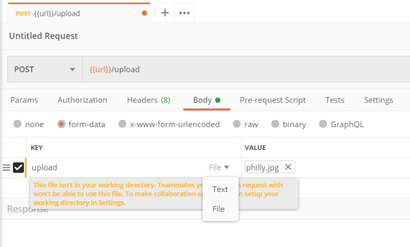

You need to select the **file** option and you can then search for a file to upload. Once you have selected an image to upload click on the **Send** button and you should receive a status of **200**.

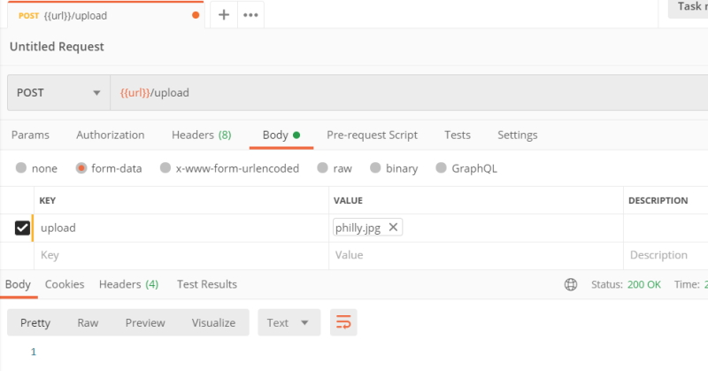

In the *images* folder you will see your image.

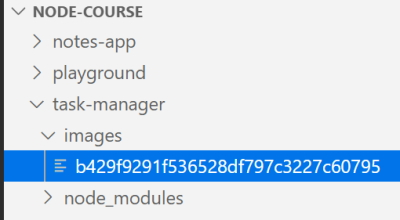

Notice that the image has a guid for a name and no extension. We can give it a *.jpg* extension and VS Code will be able to view the file.

##### Challenge

Setup endpoint for Avatar upload

1. Add /POST/users/me/avatar to the User router.
2. Setup Multer to store avatars in an avatars directory.
3. Choose "avatar" as the name for the key when registering the middleware.
4. Send back a "200" response from route handler.
5. Test your work. Create a new Task App request and upload an image.

in **src/routers/users.js**.

```
    const upload = multer({
        dest: 'avatars'
    });

    // POST /users/me/avatar
    router.post('/users/me/avatar', upload.single('avatar'), (req, res) => {
        res.send();
    });
```

Set up the endpoint in Postman.

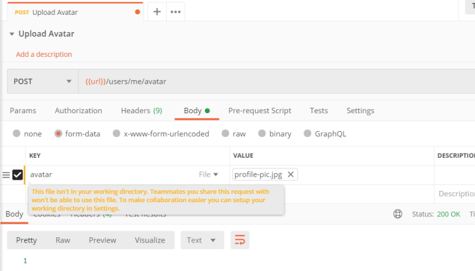

Check the avatar directory.

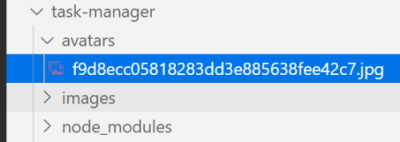

### Validating File Uploads

We will now learn how to validate file uploads. This will allow you to reject files that are too large or files of the wrong type.

#### Validating Multer Uploads

The multer configuration below adds these two types of validation.

``limits.fileSize`` is set to limit the file size in bytes. The configuration below uses 1,000,000 bytes which is equivalent to 1 megabyte.

```
    const upload = multer({
        dest: 'images',
        limits: {
            fileSize: 1000000
        }
    });
```

To test this use the **Upload image** endpoint in Postman to upload the philly.jpg again. This will work because the file is less than 1 Mb in size.

Test again using the fall.jpg file and this time it will fail because the file is 1.5 Mb in size.

In Postman we get a status code of **500**.

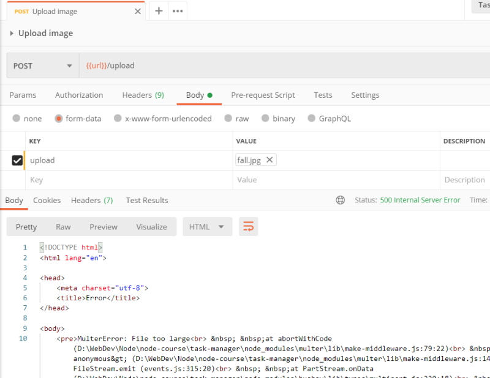

The error message is in HTML but we can change this to send back JSON.

In VS Code.

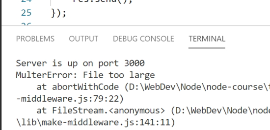

### Validating file types

``fileFilter`` is set to validate the file type. The method below will reject all documents that don't have either .doc or .docx file extensions. This same technique could be used to limit uploads to just images, PDFs, or any other file type.

We need to check out the Multer documentation to see how to use ``fileFilter``.

[Multer documentation website.](https://www.npmjs.com/package/multer "Multer documentation website.")

We can set this up to only accept **.pdf** files.

```
    const upload = multer({
        dest: 'images',
        limits: {
            fileSize: 1000000
        },
        fileFilter(req, file, cb) {
            if (!file.originalname.endsWith('.pdf')) {
                return cb(new Error('File must be a .pdf!'));
            }

            cb(undefined, true);
        }
    });
```

Now, what if we want to allow multiple extensions? The following code allows for **.doc** or **.docx** files.

```
    const upload = multer({
        dest: 'images',
            limits: {
            fileSize: 1000000
        },
        fileFilter(req, file, cb) {
            if (!file.originalname.match(/\.(doc|docx)$/)) {
                return cb(new Error('Please upload a Word document'));
            }

            cb(undefined, true);
        }
    });
```

##### Challenge

Add validation to the update avatar route.

1. Limit the upload size to 1 Mb.
2. Only allow .jpg, .jpeg or .png files to be uploaded.
3. Test your work. Upload > 1 Mb files should fail and non images should also fail.

##### src/routers/user.js (partial)

```
    const upload = multer({
        dest: 'avatars',
        limits: {
            fileSize: 1000000
        },
        fileFilter(req, file, cb) {
            if (!file.originalname.match(/\.(jpg|jpeg|png)$/)) {
                return cb(new Error('Please upload an image!'));
            }

            cb(undefined, true);
        }
    });
```

### Handling Express Errors

You'll now customize the errors that multer provides. This will give you complete control of what sort of response the client gets when their upload is rejected.

#### Handling Express Errors

You can handle errors from the middleware function by providing a function to Express. As shown below, a new function is passed as the final argument to router.post. This function accepts error, req, res, and next. This call signature lets Express know the function is designed to handle errors.

The function itself sends back a JSON response with the error message from multer.

```
    const upload = multer({
        dest: 'images',
        limits: {
            fileSize: 1000000
        },
        fileFilter(req, file, cb) {
            if (!file.originalname.match(/\.(doc|docx)$/)) {
                return cb(new Error('Please upload a Word document!'));
            }

            cb(undefined, true);
        }
    });

    app.post('/upload', upload.single('upload'), (req, res) => {
        res.send();
    }, (error, req, res, next) => {
        res.status(400).send({ error: error.message });
    });
```

Try and upload a Word document.

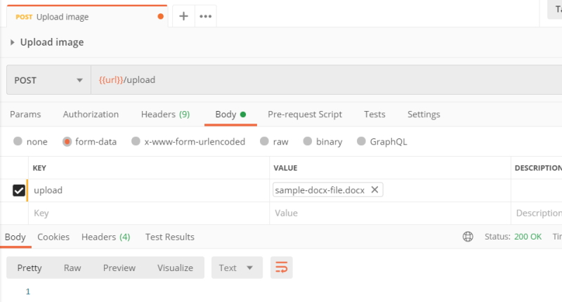

Now try and upload a PDF document.

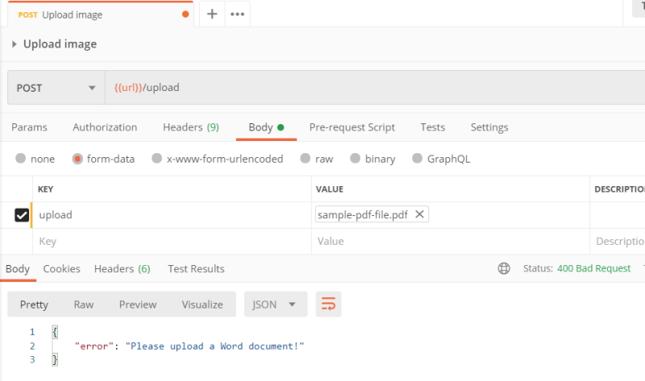

All we did was add another function on to the request handler to handle the error. This would work for patch, delete or get as well.

We need to keep the same signature that we see in the code above.

```
    }, (error, req, res, next) => {
```

This lets Express know that this is to catch any uncaught errors because Multer threw an error when it go a bad upload.

##### Challenge

Clean up the error handling in the avatar route handler.

1. Setup an error handler function.
2. Send back a 400 withthe error message.
3. Test your work.

##### src/routers/user.js (partial)

```
    // POST /users/me/avatar
    router.post('/users/me/avatar', upload.single('avatar'), (req, res) => {
        res.send();
    }, (error, req, res, next) => {
        res.status(400).send({ error: error.message });
    });
```

Try to add an image.

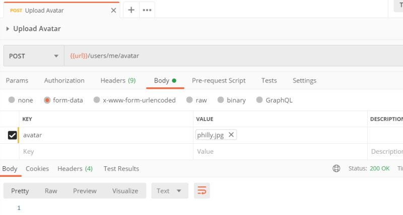

Try to add a non image.

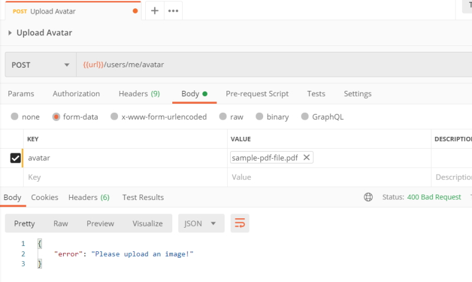

### Adding Images to the User Profile

At the moment our images are not attached to any user. We are now going to learn how to associate the uploaded avatar with the users account.

A new field needs to be added to the user model to store the avatar image data. The snippet below adds avatar on the user with the type of Buffer. The Buffer type should be used when storing binary data, which is exactly the type of data that multer provides.

```
    // partial code
    const userSchema = new mongoose.Schema({
        avatar: {
            type: Buffer
        }
    });
```

The avatar upload route will be able to change the user profile data, so the route should be put behind authentication. The handler function grabs the binary data and stores it on the avatar field. Finally, the changes are saved.

```
    router.post('/users/me/avatar', auth, upload.single('avatar'), async (req, res) => {
        req.user.avatar = req.file.buffer
        await req.user.save()
        res.send()
    }, (error, req, res, next) => {
        res.status(400).send({ error: error.message })
    });
```

If I try to save my avatar without logging in as a user.

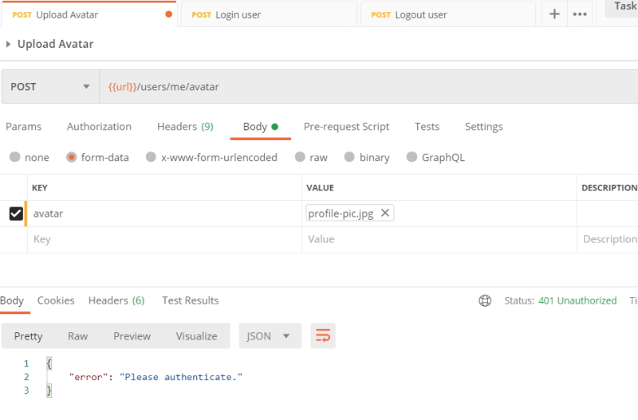

When I login as a user I get a status of **200** and an empty body as there is no reason to send back a message.

I can now check the database to see my avatar field.

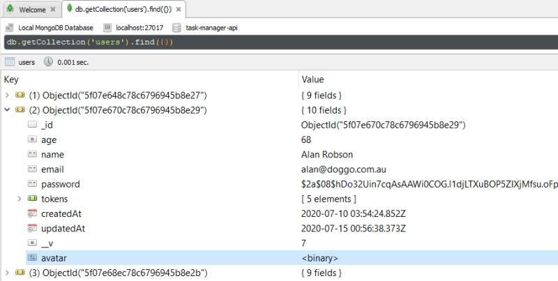

If we edit the document we can copy out the binary image in between the double quotes. We can go to jsbin.com and add some html to view the image in a browser. The binary image content below has been shortened.

```
    <!DOCTYPE html>
    <html>
    <head>
      <meta charset="utf-8">
      <meta name="viewport" content="width=device-width">
      <title>JS Bin</title>
    </head>
    <body>
    <h1>Test image</h1>
    
    </body>
    </html>
```

This is how the image looks in the browser.

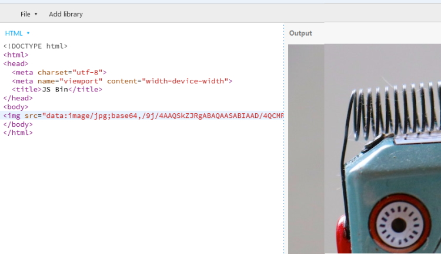

##### Challenge

Setup a route to delete the avatar from the user data.

1. Setup // DELETE /users/me/avatar.
2. Add authentication.
3. Set the field to undefined and save the user sending back a 200.
4. Test your work by creating a new request for Task App in Postman.

##### src/routers/user.js

```
    // DELETE /users/me/avatar
    router.delete('/users/me/avatar', auth, async (req, res) => {
        req.user.avatar = undefined;

        try {
            await req.user.save();
            res.send();
        } catch (e) {
            res.status(500).send();
        }
    });
```

I get back a status of **200** telling me that everything went fine. If I look in the database the avatar field has been removed.

### Serving up Files

We are now going to serve up user profile images. These images will be served up as if they were static assets for the application.

Serving up the user avatars will require two pieces of data from the server. The first is the image data, and the second is the **Content-Type** header. The image data is stored on the user profile. The header should be set equal to **image/jpg** which lets the client know they're getting a jpg image back.

The route below fetches the image data and sets the **Content-Type** header for the response. The URL could be visited to view the profile picture.

```
    // GET /users/123456789/avatar
    router.get('/users/:id/avatar', async (req, res) => {
        try {
            const user = await User.findById(req.params.id);

            if (!user || !user.avatar) {
                throw new Error();
            }

            res.set('Content-Type', 'image/jpg');
            res.send(user.avatar);
        } catch (e) {
            res.status(404).send();
        }
    });
```

We can use this URL in the browser to get back the image.

http://127.0.0.1:3000/users/5f07e670c78c6796945b8e29/avatar

### Auto-Cropping and Image Formatting

We are going to learn how to resize and format images. This will let you create uniform sizes and file types for user avatars.

First up, install the npm library.

```
    npm i sharp
```

Now, sharp can be used to manipulate uploaded images. Before the image data is added onto the user profile, the data should be passed through sharp. The example below uses resize to resize all uploads to 250 by 250 pixels. The example also uses **png** to convert all images to portable network graphics. Lastly, ``toBuffer`` is used to retrieve the modified image data. The modified data is what should be saved in the database.

We make a small change to *src/models.user.js* by deleting the avatar.

```
    userSchema.methods.toJSON = function () {
        const user = this;
        const userObject = user.toObject();

        delete userObject.password;
        delete userObject.tokens;
        delete userObject.avatar;

        return userObject;
    }
```

Then we change the route handler.

```
    const sharp = require('sharp');

    // POST /users/me/avatar
    router.post('/users/me/avatar', auth, upload.single('avatar'), async (req, res) => {
        const buffer = await sharp(req.file.buffer).resize({ width: 250, height: 250 }).png().toBuffer();
        req.user.avatar = buffer;
        await req.user.save();
        res.send();
    }, (error, req, res, next) => {
        res.status(400).send({ error: error.message });
    });
```

We take the uploaded image and resize and change the avatar to a **.png** file. This creates a manageble image to use as an avatar seeing as the original **.jpg** image is 1920 * 1080 pixels in size.

We can view the image in JSBin.com

```
    Test image</h1>
    
```

or we can run the URL.

http://127.0.0.1:3000/users/5f07e670c78c6796945b8e29/avatar

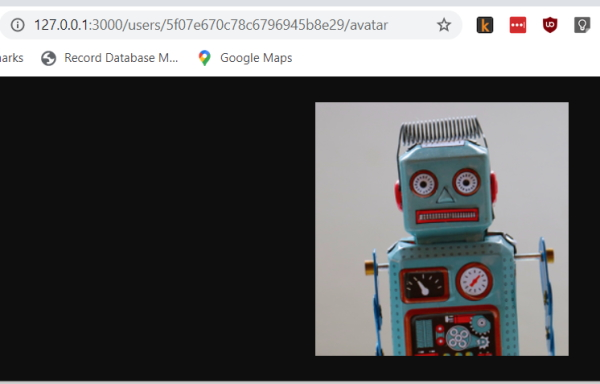

If you try and save this image you will see that it is now a **.png** image.
